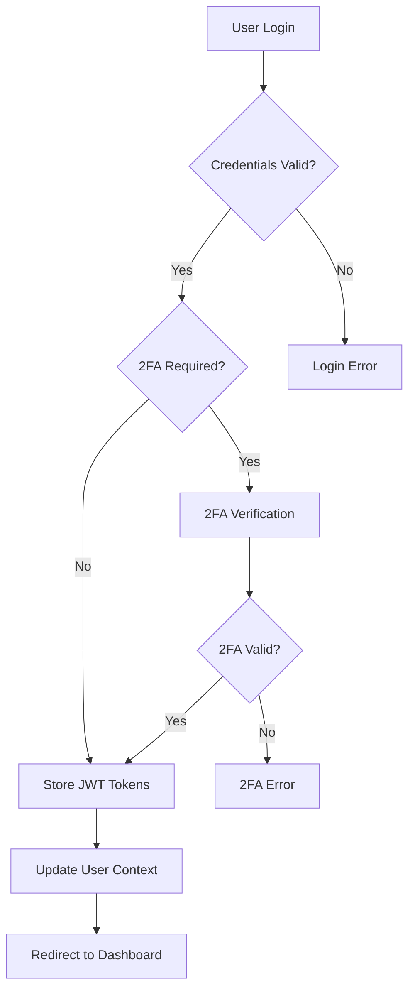
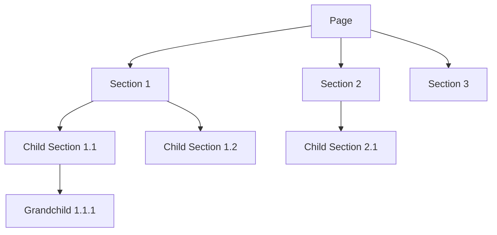
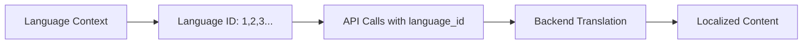
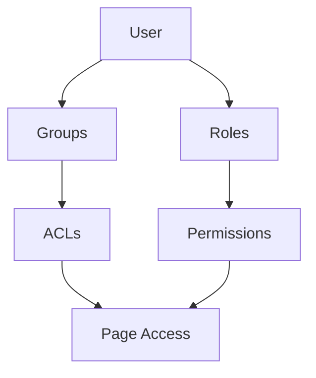

# 🚀 SelfHelp Frontend - Comprehensive Developer Guide

**Version**: 0.0.2  
**Tech Stack**: Next.js 15, React 18, TypeScript, Mantine UI v8, Tailwind CSS, React Query v5, Refine.dev  
**Target Audience**: Developers, AI Coding Assistants, LLMs

---

## 📋 Table of Contents

1. [🏗️ Architecture Overview](#architecture-overview)
2. [🔐 Authentication System](#authentication-system)
3. [🌐 CMS Structure & Page System](#cms-structure--page-system)
4. [⚡ React Query & Caching Strategy](#react-query--caching-strategy)
5. [🎨 Component Architecture & Styling](#component-architecture--styling)
6. [🔗 API Layer & Endpoint Management](#api-layer--endpoint-management)
7. [🌍 Language System & Internationalization](#language-system--internationalization)
8. [🛠️ Admin Panel & Inspector System](#admin-panel--inspector-system)
9. [👥 User Permissions & ACL System](#user-permissions--acl-system)
10. [📱 Responsive Design & Theming](#responsive-design--theming)
11. [🚀 Performance & Optimization](#performance--optimization)
12. [🔧 Development Guidelines](#development-guidelines)
13. [📈 Expansion Guide](#expansion-guide)

---

## 🏗️ Architecture Overview

### Core Principles
- **Server-First**: Prioritize React Server Components, minimize `'use client'`
- **Type Safety**: Full TypeScript coverage with strict typing
- **Modularity**: Reusable, composable components
- **Performance**: Optimized caching and lazy loading
- **Accessibility**: WCAG compliant with proper ARIA support

### Directory Structure
```
src/
├── app/                    # Next.js App Router
│   ├── admin/             # Admin panel routes
│   ├── auth/              # Authentication pages
│   ├── components/        # All React components (organized by usage)
│   │   ├── cms/           # CMS backend components (admin panel)
│   │   │   ├── admin-shell/    # Admin layout and navigation
│   │   │   ├── pages/          # Page management components
│   │   │   ├── sections/       # Section management components
│   │   │   ├── users/          # User management components
│   │   │   ├── groups/         # Group management components
│   │   │   ├── roles/          # Role management components
│   │   │   ├── assets/         # Asset management components
│   │   │   ├── cache/          # Cache management components
│   │   │   ├── data/           # Data management components
│   │   │   ├── actions/        # Action management components
│   │   │   ├── scheduled-jobs/ # Job management components
│   │   │   ├── unused-sections/# Unused sections management
│   │   │   ├── shared/         # Shared CMS components (inspectors, field renderers)
│   │   │   └── ui/             # CMS-specific UI components
│   │   ├── frontend/      # Frontend user-facing components
│   │   │   ├── content/        # Page content rendering
│   │   │   ├── layout/         # Website layout (header, footer)
│   │   │   └── styles/         # Dynamic style components (82+ types)
│   │   ├── shared/        # Components used in both CMS and frontend
│   │   │   ├── auth/           # Authentication components
│   │   │   ├── common/         # Common utilities (loading, modals, etc.)
│   │   │   └── ui/             # Shared UI components
│   │   └── contexts/      # React contexts
│   └── store/             # Client state management
├── api/                   # API layer
│   ├── admin/             # Admin API endpoints
│   ├── auth.api.ts        # Authentication API
│   ├── base.api.ts        # Base API client
│   └── page.api.ts        # Page content API
├── config/                # Configuration files
├── hooks/                 # Custom React hooks
├── providers/             # React providers
├── types/                 # TypeScript definitions
└── utils/                 # Utility functions
```

### Technology Stack Details

**Core Framework**
- **Next.js 15**: App Router with SSR/SSG capabilities
- **React 18**: Concurrent features and Suspense
- **TypeScript 5.5**: Strict type checking

**UI & Styling**
- **Mantine UI v8**: Primary component library (50+ components)
- **Tailwind CSS**: Utility-first CSS framework
- **CSS Modules**: Component-scoped styling
- **PostCSS**: CSS processing and optimization

**State Management**
- **React Query v5**: Server state management and caching
- **Zustand**: Lightweight client state (when needed)
- **React Context**: Global UI state

**Additional Libraries**
- **Refine.dev**: Admin panel framework
- **Pragmatic Drag & Drop**: Modern drag-and-drop (4.7kB)
- **Monaco Editor**: Code editing capabilities
- **React Markdown**: Markdown rendering

---

## 🔐 Authentication System

### JWT Token Management

The authentication system uses a dual-token approach with automatic refresh:

```typescript
// Token Storage (src/utils/auth.utils.ts)
export const storeTokens = (accessToken: string, refreshToken: string) => {
    localStorage.setItem('access_token', accessToken);
    localStorage.setItem('refresh_token', refreshToken);
};

// Automatic Token Refresh (src/api/base.api.ts)
apiClient.interceptors.response.use(
    (response) => response,
    async (error) => {
        if (error.response?.status === 401) {
            const newToken = await AuthApi.refreshToken();
            // Retry original request with new token
            return apiClient(originalRequest);
        }
        return Promise.reject(error);
    }
);
```

### Authentication Flow



### Key Features
- **JWT Tokens**: Access token (short-lived) + Refresh token (long-lived)
- **2FA Support**: Time-based one-time passwords
- **Auto Refresh**: Transparent token renewal
- **Permission Checking**: Role-based access control
- **Language Preferences**: Stored in JWT payload

### Auth API Methods
```typescript
// Login with credentials
await AuthApi.login({ email, password });

// Verify 2FA code
await AuthApi.verifyTwoFactor({ user_id, code });

// Refresh tokens
await AuthApi.refreshToken();

// Update language preference
await AuthApi.updateLanguagePreference(languageId);

// Logout
await AuthApi.logout();
```

---

## 🌐 CMS Structure & Page System

### Page-Section Hierarchy

The CMS follows a hierarchical structure where **Pages** contain **Sections**, and sections can contain **child sections**:



### Page Types & Properties

**Page Properties** (non-translatable):
- `keyword`: Unique identifier
- `url`: URL pattern
- `protocol`: HTTP methods allowed
- `headless`: Layout control
- `nav_position`: Header menu position
- `footer_position`: Footer menu position
- `page_access_type_code`: Access control
- `open_access`: Public access flag

**Page Content** (translatable):
- Dynamic fields based on page configuration
- Multi-language support
- Field types: text, textarea, markdown-inline, checkbox

### Section System

**Section Properties**:
- `id`: Unique identifier
- `name`: Display name
- `style_name`: Determines rendering component
- `position`: Order within parent
- `can_have_children`: Nesting capability
- `parent_id`: Parent section reference

**Dynamic Style Components**:
```typescript
// 82+ style components for different content types
const styleComponents = {
    'container': ContainerStyle,
    'heading': HeadingStyle,
    'markdown': MarkdownStyle,
    'image': ImageStyle,
    'button': ButtonStyle,
    'form': FormStyle,
    // ... 75+ more styles
};
```

### Page Rendering Process

1. **Route Resolution**: `[[...slug]]/page.tsx` catches all dynamic routes
2. **Content Fetching**: `usePageContent(keyword, languageId)` fetches page data
3. **Section Rendering**: `BasicStyle` component routes to appropriate style component
4. **Field Extraction**: Helper functions extract content from dual structure

```typescript
// Field extraction pattern
const getFieldContent = (style: TStyle, fieldName: string): any => {
    // Direct property access
    if (style[fieldName]?.content !== undefined) {
        return style[fieldName].content;
    }
    // Nested fields object access
    if (style.fields?.[fieldName]?.content !== undefined) {
        return style.fields[fieldName].content;
    }
    return null;
};
```

---

## ⚡ React Query & Caching Strategy

### Global Configuration

```typescript
// src/config/react-query.config.ts
export const REACT_QUERY_CONFIG = {
    CACHE: {
        staleTime: 30 * 1000,     // 30 seconds - data freshness
        gcTime: 60 * 1000,        // 60 seconds - cache retention
    },
    SPECIAL_CONFIGS: {
        STATIC_DATA: {            // Lookups, styles, etc.
            staleTime: 5 * 60 * 1000,   // 5 minutes
            gcTime: 10 * 60 * 1000,     // 10 minutes
        },
        REAL_TIME: {              // Live data
            staleTime: 0,               // Always stale
            gcTime: 1000,               // 1 second
        }
    }
};
```

### Caching Strategy

**Short Cache (30s)**: Dynamic content that changes frequently
- Page content
- User data
- Admin data

**Medium Cache (5min)**: Semi-static data
- Lookups
- Style groups
- Language lists

**Long Cache (10min)**: Static configuration data
- System preferences
- Style definitions

### Custom Hooks Pattern

```typescript
// Standard query hook pattern
export function usePageContent(keyword: string, languageId?: number) {
    return useQuery({
        queryKey: ['page-content', keyword, languageId],
        queryFn: () => PageApi.getPageContent(keyword, languageId),
        staleTime: REACT_QUERY_CONFIG.CACHE.staleTime,
        gcTime: REACT_QUERY_CONFIG.CACHE.gcTime,
        enabled: !!keyword && !!languageId,
    });
}

// Mutation hook pattern
export function useUpdatePageMutation() {
    const queryClient = useQueryClient();
    
    return useMutation({
        mutationFn: (data: IUpdatePageRequest) => 
            AdminPageApi.updatePage(data.keyword, data),
        onSuccess: (data, variables) => {
            // Invalidate related queries
            queryClient.invalidateQueries({ queryKey: ['adminPages'] });
            queryClient.invalidateQueries({ queryKey: ['page-content'] });
        },
    });
}
```

### Query Key Patterns

```typescript
// Consistent query key structure
QUERY_KEYS: {
    FRONTEND_PAGES: (languageId: number) => ['frontend-pages', languageId],
    PAGE_CONTENT: (keyword: string, languageId?: number) => 
        languageId ? ['page-content', keyword, languageId] : ['page-content', keyword],
    ADMIN_PAGES: ['admin-pages'],
    LOOKUPS: ['lookups'],
    STYLE_GROUPS: ['style-groups'],
}
```

---

## 🎨 Component Architecture & Styling

### Component Hierarchy

**Mantine-First Approach**: Always prefer Mantine components over custom HTML/Tailwind:

```typescript
// ✅ GOOD - Use Mantine components
<Container size="xl">
    <Stack gap="lg">
        <Group justify="space-between" align="center">
            <Text size="xl" fw={700}>Title</Text>
            <Button variant="filled">Action</Button>
        </Group>
    </Stack>
</Container>

// ❌ AVOID - Custom Tailwind classes
<div className="max-w-7xl mx-auto">
    <div className="flex flex-col gap-4">
        <div className="flex justify-between items-center">
            <h1 className="text-xl font-bold">Title</h1>
            <button className="bg-blue-500 text-white px-4 py-2">Action</button>
        </div>
    </div>
</div>
```

### Dynamic Field Configuration System

The application supports dynamic field configuration through the `fieldConfig` property, enabling advanced select fields with API-driven options.

#### Field Configuration Structure

```typescript
interface IFieldConfig {
    multiSelect?: boolean;        // Enable multi-select functionality
    creatable?: boolean;          // Allow custom value creation
    separator?: string;           // Separator for multi-select values (default: " ")
    options?: Array<{            // Static options array
        value: string;
        text: string;
    }>;
    apiUrl?: string;             // API endpoint for dynamic options
}
```

#### Supported Field Types

**select-css**: Dynamic CSS class selection with API integration
- **Multi-select support**: Select multiple CSS classes
- **API integration**: Fetches options from `/frontend/css-classes`
- **Searchable**: Real-time filtering of options
- **Separator handling**: Configurable separator for multi-select values (default: space)

**select-group**: Dynamic group selection with API integration
- **Multi-select support**: Select multiple groups
- **API integration**: Fetches options from `/frontend/groups-options`
- **Searchable**: Real-time filtering of options
- **Separator handling**: Configurable separator for multi-select values (default: comma)

**select-data_table**: Dynamic data table selection
- **Single select only**: Select one data table
- **API integration**: Fetches options from `/frontend/data-tables-options`
- **Searchable**: Real-time filtering of options
- **Separator handling**: Configurable separator (default: comma)

**select-page-keyword**: Dynamic page keyword selection with API integration
- **Multi-select support**: Select multiple page keywords
- **API integration**: Fetches options from `/frontend/page-keywords-options`
- **Searchable**: Real-time filtering of options
- **Separator handling**: Configurable separator for multi-select values (default: comma)

#### Implementation Example

```typescript
// CSS field configuration from backend
{
    "id": 23,
    "name": "css",
    "title": "CSS Classes",
    "type": "select-css",
    "fieldConfig": {
        "multiSelect": true,
        "creatable": true,
        "separator": " ",
        "apiUrl": "/cms-api/v1/frontend/css-classes"
    }
}

// Group field configuration from backend
{
    "id": 24,
    "name": "groups",
    "title": "Groups",
    "type": "select-group",
    "fieldConfig": {
        "multiSelect": true,
        "separator": ",",
        "apiUrl": "/cms-api/v1/frontend/groups-options"
    }
}

// Data table field configuration from backend
{
    "id": 25,
    "name": "data_tables",
    "title": "Data Tables",
    "type": "select-data_table",
    "fieldConfig": {
        "multiSelect": false,
        "separator": ",",
        "apiUrl": "/cms-api/v1/frontend/data-tables-options"
    }
}

// Page keyword field configuration from backend
{
    "id": 26,
    "name": "page_keywords",
    "title": "Page Keywords",
    "type": "select-page-keyword",
    "fieldConfig": {
        "multiSelect": true,
        "separator": ",",
        "apiUrl": "/cms-api/v1/frontend/page-keywords-options"
    }
}

// API Response Structure (for all select fields)
{
    "status": 200,
    "data": {
        "options": [
            { "value": "option_id", "text": "Option Name" }
        ]
    }
}

// CSS Classes API Response (special format)
{
    "status": 200,
    "data": {
        "classes": [
            { "value": "container", "text": "container" },
            { "value": "mx-auto", "text": "mx-auto" },
            { "value": "flex", "text": "flex" }
        ]
    }
}
```

#### Field Renderer Integration

The `FieldRenderer` component automatically handles field configuration:

```typescript
// Automatic field type detection and rendering
if (field.type === 'select-css') {
    const { data: cssClasses, isLoading } = useCssClasses();
    const fieldConfig = field.fieldConfig;
    
    // Convert API options to Mantine format
    const options = (fieldConfig.options || cssClasses || []).map(option => ({
        value: option.value,
        label: option.text
    }));
    
    // Render appropriate select component
    if (fieldConfig.multiSelect) {
        return <MultiSelect data={options} searchable clearable />;
    } else {
        return <Select data={options} searchable clearable />;
    }
}
```

#### API Integration Pattern

**CSS Classes API** (`/frontend/css-classes`):
- **Purpose**: Provides available CSS classes for select fields
- **Response**: Array of `{value, text}` objects in `data.classes`
- **Caching**: Uses static data caching (5 minutes)
- **Usage**: Automatically loaded when field is rendered

**Groups Options API** (`/frontend/groups-options`):
- **Purpose**: Provides available groups for select fields
- **Response**: Array of `{value, text}` objects in `data.options`
- **Caching**: Uses static data caching (5 minutes)
- **Usage**: Automatically loaded when field is rendered

**Data Tables Options API** (`/frontend/data-tables-options`):
- **Purpose**: Provides available data tables for select fields
- **Response**: Array of `{value, text}` objects in `data.options`
- **Caching**: Uses static data caching (5 minutes)
- **Usage**: Automatically loaded when field is rendered

**Page Keywords Options API** (`/frontend/page-keywords-options`):
- **Purpose**: Provides available page keywords for select fields
- **Response**: Array of `{value, text}` objects in `data.options`
- **Caching**: Uses static data caching (5 minutes)
- **Usage**: Automatically loaded when field is rendered

**React Query Hooks**:
```typescript
// CSS Classes Hook
export function useCssClasses() {
    return useQuery({
        queryKey: ['css-classes'],
        queryFn: async () => {
            const response = await FrontendApi.getCssClasses();
            return response.data.classes;
        },
        staleTime: REACT_QUERY_CONFIG.SPECIAL_CONFIGS.STATIC_DATA.staleTime,
    });
}

// Groups Options Hook
export function useGroupsOptions() {
    return useQuery({
        queryKey: ['groups-options'],
        queryFn: async () => {
            const response = await FrontendApi.getGroupsOptions();
            return response.data.options;
        },
        staleTime: REACT_QUERY_CONFIG.SPECIAL_CONFIGS.STATIC_DATA.staleTime,
    });
}

// Data Tables Options Hook
export function useDataTablesOptions() {
    return useQuery({
        queryKey: ['data-tables-options'],
        queryFn: async () => {
            const response = await FrontendApi.getDataTablesOptions();
            return response.data.options;
        },
        staleTime: REACT_QUERY_CONFIG.SPECIAL_CONFIGS.STATIC_DATA.staleTime,
    });
}

// Page Keywords Options Hook
export function usePageKeywordsOptions() {
    return useQuery({
        queryKey: ['page-keywords-options'],
        queryFn: async () => {
            const response = await FrontendApi.getPageKeywordsOptions();
            return response.data.options;
        },
        staleTime: REACT_QUERY_CONFIG.SPECIAL_CONFIGS.STATIC_DATA.staleTime,
    });
}
```

#### Value Handling

**Multi-select values** are stored as space-separated strings:
```typescript
// Input: ["container", "mx-auto", "p-4"]
// Storage: "container mx-auto p-4"
// Display: Split by separator and show as individual selections
```

**Single select values** are stored as single strings:
```typescript
// Input: "container"
// Storage: "container"
// Display: Single selected value
```

#### Adding New Field Types

1. **Define field configuration**:
```typescript
interface INewFieldConfig extends IFieldConfig {
    customProperty?: string;
}
```

2. **Add to FieldRenderer**:
```typescript
if (field.type === 'new-field-type') {
    // Custom rendering logic
    return renderFieldWithBadge(<CustomComponent />);
}
```

3. **Create API service**:
```typescript
export const NewFieldApi = {
    async getOptions(): Promise<INewFieldResponse> {
        const response = await apiClient.get(API_CONFIG.ENDPOINTS.NEW_FIELD_OPTIONS);
        return response.data;
    }
};
```

4. **Create React Query hook**:
```typescript
export function useNewFieldOptions() {
    return useQuery({
        queryKey: ['new-field-options'],
        queryFn: NewFieldApi.getOptions,
        staleTime: REACT_QUERY_CONFIG.SPECIAL_CONFIGS.STATIC_DATA.staleTime,
    });
}
```

### Style System Architecture

**Dynamic Style Components**: 82+ components for different content types

```typescript
// BasicStyle.tsx - Component factory
const BasicStyle: React.FC<IBasicStyleProps> = ({ style }) => {
    switch (style.style_name) {
        case 'container': return <ContainerStyle style={style} />;
        case 'heading': return <HeadingStyle style={style} />;
        case 'markdown': return <MarkdownStyle style={style} />;
        case 'image': return <ImageStyle style={style} />;
        // ... 78+ more cases
        default: return <UnknownStyle style={style} />;
    }
};
```

**Style Categories**:
- **Layout**: container, div, card, jumbotron
- **Content**: heading, markdown, plaintext, rawText
- **Media**: image, video, audio, carousel
- **Forms**: input, textarea, select, checkbox, radio
- **Navigation**: button, link, navigationContainer
- **Interactive**: tabs, accordion, modal, quiz

### Component Organization

The component architecture follows a clear separation based on usage context:

```
src/app/components/
├── cms/                # CMS Backend Components (Admin Panel)
│   ├── admin-shell/    # Admin layout and navigation shell
│   ├── pages/          # Page management (inspector, list, create)
│   ├── sections/       # Section management and editing
│   ├── users/          # User management and forms
│   ├── groups/         # Group management and ACL editing
│   ├── roles/          # Role management
│   ├── assets/         # Asset management and upload
│   ├── cache/          # Cache management and monitoring
│   ├── data/           # Data table management
│   ├── actions/        # Action configuration and management
│   ├── scheduled-jobs/ # Job scheduling and monitoring
│   ├── unused-sections/# Cleanup and maintenance tools
│   ├── shared/         # Shared CMS components
│   │   ├── field-components/     # Form field types
│   │   ├── field-renderer/       # Universal field renderer
│   │   ├── inspector-layout/     # Inspector UI framework
│   │   ├── inspector-header/     # Inspector header component
│   │   ├── fields-section/       # Collapsible field sections
│   │   └── acl-selector/         # ACL management component
│   └── ui/             # CMS-specific UI components
├── frontend/           # Frontend User-Facing Components
│   ├── content/        # Page content rendering
│   │   ├── PageContentRenderer.tsx    # Main content renderer
│   │   ├── PageRenderer.tsx           # Page wrapper
│   │   └── PageContentRendererClient.tsx # Client-side renderer
│   ├── layout/         # Website layout components
│   │   ├── WebsiteHeader.tsx          # Main header
│   │   ├── WebsiteHeaderOptimized.tsx # Optimized header
│   │   ├── WebsiteHeaderServer.tsx    # Server header
│   │   ├── WebsiteHeaderMenu.tsx      # Header navigation
│   │   ├── WebsiteFooter.tsx          # Main footer
│   │   └── WebsiteFooterOptimized.tsx # Optimized footer
│   └── styles/         # Dynamic style components (82+ types)
│       ├── BasicStyle.tsx             # Main style component factory
│       ├── SelfHelpStyles.ts          # Style exports
│       ├── ContainerStyle.tsx         # Layout styles
│       ├── HeadingStyle.tsx           # Typography styles
│       ├── ImageStyle.tsx             # Media styles
│       ├── FormStyle.tsx              # Form styles
│       ├── ButtonStyle.tsx            # Interactive styles
│       ├── MarkdownStyle.tsx          # Content styles
│       ├── TabsStyle.tsx              # Navigation styles
│       └── ... (75+ more style components)
├── shared/             # Components Used in Both CMS and Frontend
│   ├── auth/           # Authentication components
│   │   ├── AuthButton.tsx             # Login/logout button
│   │   └── AuthButtonClient.tsx       # Client-side auth button
│   ├── common/         # Common utilities and UI
│   │   ├── LoadingScreen.tsx          # Loading spinner
│   │   ├── CustomModal.tsx            # Modal wrapper
│   │   ├── LanguageSelector.tsx       # Language switcher
│   │   ├── ThemeToggle.tsx            # Dark/light mode toggle
│   │   ├── SelfHelpLogo.tsx           # Brand logo
│   │   ├── BurgerMenuClient.tsx       # Mobile menu
│   │   ├── navbar-links-group/        # Navigation components
│   │   └── debug/                     # Debug system components
│   └── ui/             # Shared UI components
│       └── InternalLink.tsx           # Internal navigation link
└── contexts/           # React Contexts
    ├── LanguageContext.tsx            # Language management
    ├── EnhancedLanguageProvider.tsx   # Enhanced language features
    └── PageContentContext.tsx         # Page content state
```

### Component Usage Guidelines

**CMS Components** (`src/app/components/cms/`):
- Used exclusively in the admin panel (`/admin` routes)
- Include inspectors, forms, management interfaces
- Have admin-specific styling and functionality
- Examples: `PageInspector`, `UsersList`, `AdminShell`

**Frontend Components** (`src/app/components/frontend/`):
- Used exclusively on the public website
- Include page rendering, layout, and dynamic styles
- Optimized for end-user experience
- Examples: `PageRenderer`, `WebsiteHeader`, `BasicStyle`

**Shared Components** (`src/app/components/shared/`):
- Used in both CMS and frontend contexts
- Include authentication, common utilities, and basic UI
- Must work seamlessly in both environments
- Examples: `AuthButton`, `LoadingScreen`, `LanguageSelector`

### Theming System

```typescript
// theme.ts - Mantine theme configuration
export const theme = createTheme({
    primaryColor: 'blue',
    defaultColorScheme: 'auto',
    fontFamily: 'Inter, sans-serif',
    headings: {
        fontFamily: 'Inter, sans-serif',
    },
    components: {
        Button: Button.extend({
            defaultProps: {
                size: 'sm',
            },
        }),
    },
});
```

**Dark/Light Theme Support**: Automatic theme switching based on system preference

---

## 🏗️ Component Architecture Refactoring

### Modular Component Structure

The application has been refactored to follow a clear, modular component architecture that separates concerns based on usage context. This refactoring improves maintainability, reduces coupling, and makes the codebase easier to understand and navigate.

### Three-Tier Component Architecture

**1. CMS Backend Components** (`src/app/components/cms/`):
- **Purpose**: Admin panel functionality and content management
- **Usage**: Exclusively used in `/admin` routes
- **Characteristics**: 
  - Complex forms and data management interfaces
  - Inspector components for editing content
  - Administrative tools and dashboards
  - Permission-aware components
  - Rich interaction patterns (drag-and-drop, modals, etc.)

**2. Frontend User-Facing Components** (`src/app/components/frontend/`):
- **Purpose**: Public website rendering and user experience
- **Usage**: Exclusively used in public routes (`/`, `/[...slug]`)
- **Characteristics**:
  - Optimized for performance and SEO
  - Dynamic content rendering from CMS data
  - Responsive design for all devices
  - Minimal JavaScript for better performance
  - 82+ dynamic style components for flexible content display

**3. Shared Components** (`src/app/components/shared/`):
- **Purpose**: Components used in both CMS and frontend contexts
- **Usage**: Used across both admin and public routes
- **Characteristics**:
  - Authentication components (login/logout)
  - Common utilities (loading screens, modals)
  - Basic UI components (links, selectors)
  - Debug and development tools
  - Language and theme management

### Component Migration Summary

**From Old Structure:**
```
components/
├── admin/     → cms/
├── website/   → frontend/layout/ + frontend/content/
├── styles/    → frontend/styles/
├── auth/      → shared/auth/
├── common/    → shared/common/
├── ui/        → cms/ui/ + shared/ui/
└── contexts/  → contexts/ (unchanged)
```

**Key Benefits of New Structure:**
- **Clear Separation**: Easy to identify component purpose and usage
- **Reduced Coupling**: CMS and frontend components are isolated
- **Better Maintainability**: Easier to find and modify components
- **Improved Onboarding**: New developers can quickly understand the structure
- **Scalability**: Easy to add new features in the appropriate category

### Import Path Updates

All import statements have been systematically updated to reflect the new structure:

```typescript
// Old imports
import { PageInspector } from '../components/admin/pages/page-inspector/PageInspector';
import { WebsiteHeader } from '../components/website/WebsiteHeader';
import { LoadingScreen } from '../components/common/LoadingScreen';

// New imports
import { PageInspector } from '../components/cms/pages/page-inspector/PageInspector';
import { WebsiteHeader } from '../components/frontend/layout/WebsiteHeader';
import { LoadingScreen } from '../components/shared/common/LoadingScreen';
```

---

## 🎯 Mention/Variable Suggestion System

### Overview

The application includes a sophisticated mention/variable suggestion system that allows users to insert dynamic variables (e.g., user data, page content, section data) into text fields using a `{{variable}}` syntax. The system provides real-time suggestions with keyboard navigation and integrates seamlessly across text inputs, rich text editors, and form builders.

### Key Features

**Real-time Variable Suggestions**:
- Typing `{{` triggers a popup with available variables
- Variables are filtered as you type additional characters
- Suggestions include custom variables and dynamic data variables from the current context

**Keyboard Navigation**:
- Arrow keys (↑/↓) to navigate through suggestions
- Auto-scrolling ensures selected items remain visible
- Enter key inserts the selected variable
- Escape key closes the popup

**Dynamic Variable Integration**:
- Custom variables defined per component
- Data variables from the current section/API context
- Automatic deduplication of duplicate variables
- Updates when section data changes

### Architecture Implementation

#### Core Components

**Suggestion Popup Components**:
```typescript
// Three main popup implementations for different use cases
- VariableList: Basic variable list with scroll and selection
- SimpleVariableSuggestions: Lightweight popup for simple inputs
- VariableSuggestionsPopup: Full-featured popup with advanced features
```

**Mention Configuration**:
```typescript
// Main configuration function (src/utils/mentions.utils.tsx)
createMentionConfigWithMantine({
  variables: [...],           // Custom variables
  dataVariables: [...],       // Dynamic section variables
  maxVisibleRows: 5,          // Visible items before scrolling
  maxItems: 50,               // Total items to display
  onSelect: (variable) => {...} // Variable insertion callback
})
```

#### Integration Points

**Rich Text Editor (TipTap)**:
```typescript
// Editor extensions with mention support
const editorExtensions = useMemo(() => [
  ...baseExtensions,
  Mention.configure({
    HTMLAttributes: { class: 'mention' },
    suggestion: createMentionConfigWithMantine({
      variables: activeVariables,
      dataVariables,
      maxVisibleRows: 5,
      maxItems: 50
    })
  })
], [activeVariables, dataVariables]);
```

**Plain Text Inputs**:
```typescript
// Direct integration for text inputs and textareas
<TextInputWithMentions
  value={value}
  onChange={onChange}
  variables={variables}
  dataVariables={dataVariables}
/>
```

#### Variable Types

**Custom Variables**: User-defined variables for specific use cases
```typescript
const customVariables = [
  { id: 'user.name', text: 'User Name' },
  { id: 'user.email', text: 'User Email' },
  { id: 'current.date', text: 'Current Date' }
];
```

**Data Variables**: Dynamic variables from API/section data
```typescript
const dataVariables = [
  { id: 'section.title', text: 'Section Title' },
  { id: 'page.keyword', text: 'Page Keyword' },
  { id: 'user.role', text: 'User Role' }
];
```

### Recent Improvements & Fixes

#### Critical Issues Resolved

**1. Popup Reopening Issue ✅**
- **Problem**: Mention popup would only appear once, requiring page refresh
- **Root Cause**: `isDestroyed` flag prevented reopening after popup closure
- **Solution**: Removed blocking flag, implemented proper cleanup function that resets state without permanent blocking

**2. Dynamic Variable Updates ✅**
- **Problem**: Variables from section API weren't updating without refresh
- **Root Cause**: Extension created once, captured variables in closure
- **Solution**: Memoized extensions with proper dependencies, recreates mention extension when variables change

**3. Arrow Key Navigation Scrolling ✅**
- **Problem**: Selected items went off-screen during keyboard navigation
- **Solution**: Implemented scroll-into-view logic with item refs and container refs, calculates positions and auto-scrolls appropriately

**4. Consistent Popup Styling ✅**
- **Problem**: Different popups had inconsistent appearance
- **Solution**: Standardized all popups to use consistent sizing (minWidth: 200px, maxWidth: 400px), item height (36px), colors, and scrollbar styling

#### Performance Optimizations

**Memoization Strategy**:
```typescript
// Base extensions (stable, recreated only when textInputMode/placeholder change)
baseExtensions = useMemo(() => [...], [textInputMode, placeholder]);

// Active variables (recalculated when variables or dataVariables change)
activeVariables = useMemo(() => [...], [variables, dataVariables]);

// Editor extensions (recreated when active variables change)
editorExtensions = useMemo(() => [...baseExtensions, Mention], [activeVariables, baseExtensions]);
```

**Cleanup Pattern**:
```typescript
const cleanup = () => {
  // Safe destruction check
  if (popup?.[0] && !popup[0].state.isDestroyed) {
    popup[0].destroy();
  }
  // Reset state without blocking future opens
  popup = null;
  component = null;
  selectedIndex = 0;
  currentSuggestions = [];
};
```

#### Files Modified

**Core Utilities** (`src/utils/mentions.utils.tsx`):
- Fixed Enter key handling for variable insertion
- Changed initial display to show all items (up to maxItems)
- Added scroll-into-view for all popup components
- Improved cleanup logic to allow reopening

**Rich Text Field** (`src/app/components/cms/shared/field-components/RichTextField.tsx`):
- Memoized base extensions with stable dependencies
- Recreates editor extensions when activeVariables change

**Text Components** (`TextInputWithMentions.tsx`, `TextareaWithMentions.tsx`):
- Fixed initial suggestions to show all available variables
- Consistent behavior across all text input components

**Modal Components** (`ConditionBuilderModal.tsx`, `FilterBuilderInline.tsx`):
- Factory functions for dataVariables closure capture
- Memoized components to prevent focus loss

#### Testing Checklist

✅ **Basic Functionality**: Typing `{{` triggers popup, clicking inserts variable  
✅ **Keyboard Navigation**: Arrow keys navigate, selection scrolls into view, Enter inserts  
✅ **Dynamic Updates**: Section variables update without refresh  
✅ **Consistent Styling**: All popups have uniform appearance and behavior  
✅ **Multiple Reopens**: Popups can be opened repeatedly without refresh  

### Usage Examples

**In Rich Text Editor**:
```typescript
<RichTextField
  value={content}
  onChange={setContent}
  variables={customVariables}
  dataVariables={sectionDataVariables}
/>
```

**In Form Builder**:
```typescript
<TextInputWithMentions
  label="Dynamic Content"
  placeholder="Type {{ to see variables..."
  value={value}
  onChange={setValue}
  variables={availableVariables}
  dataVariables={contextVariables}
/>
```

**In Condition Builder**:
```typescript
<ConditionBuilderModal
  onApply={handleApply}
  dataVariables={currentDataVariables}
  // Variables automatically available in all condition inputs
/>
```

### Future Enhancements

**Potential Improvements**:
1. **Fuzzy Search**: Implement fuzzy matching for better filtering
2. **Variable Groups**: Organize variables by category (User, Page, Section)
3. **Variable Preview**: Show variable values in popup
4. **Recent Variables**: Prioritize recently used variables
5. **Keyboard Shortcuts**: Ctrl+Space to manually trigger suggestions

**Known Limitations**:
- Variables must start with `{{` (no other trigger syntax)
- Maximum 50 variables displayed (configurable)
- Only 5 items visible before scrolling (configurable)
- No support for nested variable syntax

---

## 🔗 API Layer & Endpoint Management

### Centralized Configuration

All API endpoints are centralized in `src/config/api.config.ts`:

```typescript
export const API_CONFIG = {
    BASE_URL: `${API_BASE_URL}/cms-api/v1`,
    ENDPOINTS: {
        // Authentication
        AUTH_LOGIN: '/auth/login',
        AUTH_REFRESH_TOKEN: '/auth/refresh-token',
        AUTH_LOGOUT: '/auth/logout',
        
        // Pages
        PAGES_GET_ONE: (keyword: string) => `/pages/${keyword}`,
        ADMIN_PAGES_GET_ALL: '/admin/pages',
        ADMIN_PAGES_CREATE: '/admin/pages',
        
        // Sections
        ADMIN_SECTIONS_CREATE_CHILD: (keyword: string, parentId: number) => 
            `/admin/pages/${keyword}/sections/${parentId}/sections/create`,
            
        // ... 50+ more endpoints
    },
    CORS_CONFIG: {
        credentials: true,
        headers: {
            'Content-Type': 'application/json',
            'Accept': 'application/json',
            'X-Client-Type': 'web'
        },
    },
};
```

### API Client Structure

**Base API Client** (`src/api/base.api.ts`):
- Axios instance with interceptors
- Automatic token refresh
- Request/response logging
- Error handling

**Specialized API Modules**:
- `AuthApi`: Authentication operations
- `PageApi`: Public page content
- `AdminPageApi`: Admin page management
- `AdminUserApi`: User management
- `AdminAssetApi`: File management

### API Call Pattern

```typescript
// API service method
export const AdminPageApi = {
    async getPage(keyword: string): Promise<IAdminPageResponse> {
        const response = await apiClient.get(
            API_CONFIG.ENDPOINTS.ADMIN_PAGES_GET_ONE(keyword)
        );
        return response.data;
    },
    
    async updatePage(keyword: string, data: IUpdatePageRequest): Promise<IAdminPageResponse> {
        const response = await apiClient.put(
            API_CONFIG.ENDPOINTS.ADMIN_PAGES_UPDATE(keyword),
            data
        );
        return response.data;
    }
};

// React Query hook
export function usePageDetails(keyword: string) {
    return useQuery({
        queryKey: ['page-details', keyword],
        queryFn: () => AdminPageApi.getPage(keyword),
        enabled: !!keyword,
    });
}
```

### Adding New API Endpoints

1. **Add endpoint to config**:
```typescript
// src/config/api.config.ts
ENDPOINTS: {
    NEW_FEATURE_GET_ALL: '/admin/new-feature',
    NEW_FEATURE_CREATE: '/admin/new-feature',
}
```

2. **Create API service**:
```typescript
// src/api/admin/new-feature.api.ts
export const NewFeatureApi = {
    async getAll(): Promise<INewFeatureResponse[]> {
        const response = await apiClient.get(
            API_CONFIG.ENDPOINTS.NEW_FEATURE_GET_ALL
        );
        return response.data;
    }
};
```

3. **Create React Query hook**:
```typescript
// src/hooks/useNewFeature.ts
export function useNewFeatures() {
    return useQuery({
        queryKey: ['new-features'],
        queryFn: () => NewFeatureApi.getAll(),
        staleTime: REACT_QUERY_CONFIG.CACHE.staleTime,
    });
}
```

---

## 🌍 Language System & Internationalization

### Language Architecture

The system supports multiple languages with ID-based backend communication:



### Language Context Structure

```typescript
// src/app/contexts/LanguageContext.tsx
interface ILanguageContextValue {
    currentLanguageId: number;        // Current language ID (1, 2, 3...)
    setCurrentLanguageId: (id: number) => void;
    languages: ILanguage[];           // Available languages
    setLanguages: (languages: ILanguage[]) => void;
    isUpdatingLanguage: boolean;      // Loading state
}
```

### Authentication-Aware Language System

**Non-Authenticated Users**:
- Language preference stored in localStorage
- Uses public `/languages` endpoint
- URL parameter persistence for language state

**Authenticated Users**:
- Language preference stored in JWT token
- API call to `/auth/set-language` updates preference
- Returns new JWT with updated language info

### Content Translation System

**Field Processing Rules**:

1. **Content Fields** (`display: 1`): Translatable fields
   - Process for ALL available languages
   - Examples: titles, descriptions, content

2. **Property Fields** (`display: 0`): System fields
   - Always save with language ID 1 only
   - Examples: CSS, configuration settings, URLs

```typescript
// Field processing utility
const processFieldsByType = (fields: IField[], languages: ILanguage[]) => {
    return fields.map(field => {
        if (field.display === 1) {
            // Content field - process for all languages
            return processForAllLanguages(field, languages);
        } else {
            // Property field - language ID 1 only
            return processForLanguageOne(field);
        }
    });
};
```

### Language API Integration

```typescript
// Page content with language support
GET /pages/home?language_id=2

// Admin pages with language support
GET /admin/pages/home?language_id=3

// Language preference update
POST /auth/set-language
{
    "language_id": 3
}

// Response includes updated JWT
{
    "data": {
        "access_token": "new_jwt_token",
        "language_id": 3,
        "language_locale": "de-CH"
    }
}
```

---

## 🔄 Smart Navigation & Page Loading System

### Core Principles

The application implements an intelligent loading system that prioritizes user experience by:

1. **Always Refreshing Navigation**: Navigation data is refreshed on every page change and after user actions
2. **Smooth Transitions**: Uses `keepPreviousData` to show existing content while loading new data
3. **Minimal Loading Spinners**: Only shows loading indicators on initial page loads, not during navigation
4. **Permission-Aware**: Automatically refreshes navigation when user actions might grant new access

### Navigation Refresh Strategy

**When Navigation Gets Refreshed**:
- On every page navigation (silent background refresh)
- After form submissions (visible refresh to show new access)
- After user actions that might change permissions
- When language preferences change

**Implementation**:
```typescript
// useNavigationRefresh hook provides refresh functions
const { refreshOnPageChange, refreshAfterUserAction } = useNavigationRefresh();

// Page navigation triggers silent refresh
useEffect(() => {
    if (keyword) {
        refreshOnPageChange(); // Silent background refresh
    }
}, [keyword, refreshOnPageChange]);

// Form submissions trigger visible refresh
const submitMutation = useMutation({
    onSuccess: async () => {
        await refreshAfterUserAction(); // Visible refresh for new access
    }
});
```

### Smart Page Loading

**Loading States**:
```typescript
// Show loading spinner only on initial load (no existing data)
if ((pageLoading && !pageContent) || (navLoading && routes.length === 0)) {
    return <Loader />;
}

// During navigation, show existing content with smooth transitions
const isContentUpdating = pageFetching || isUpdatingLanguage;
return (
    <Container 
        className={`page-content-transition ${isContentUpdating ? 'page-content-loading' : ''}`}
    >
        <PageContentRenderer sections={sections} />
    </Container>
);
```

**Key Features**:
- **keepPreviousData**: Maintains previous content during navigation
- **Conditional Loading**: Only shows spinners when no data exists
- **Smooth Transitions**: CSS transitions for content updates
- **Background Updates**: New data loads silently while showing existing content

### Navigation Refresh Hooks

**useNavigationRefresh Hook**:
```typescript
export function useNavigationRefresh() {
    return {
        refreshNavigation,         // Full refresh with loading states
        refreshNavigationSilently, // Background refresh without UI impact
        refreshOnPageChange,       // Silent refresh for page navigation
        refreshAfterUserAction,    // Visible refresh after user actions
    };
}
```

**Integration in Form Submissions**:
```typescript
export function useSubmitFormMutation() {
    const { refreshAfterUserAction } = useNavigationRefresh();
    
    return useMutation({
        onSuccess: async () => {
            // Invalidate page content
            queryClient.invalidateQueries({ queryKey: ['page-content'] });
            
            // Refresh navigation in case form submission granted new access
            await refreshAfterUserAction();
        }
    });
}
```

### Benefits for User Experience

✅ **No Annoying Loading Spinners**: Users see content immediately during navigation  
✅ **Always Fresh Navigation**: Navigation reflects current user permissions  
✅ **Smooth Transitions**: Content updates smoothly without jarring reloads  
✅ **Permission-Aware**: New pages appear immediately after gaining access  
✅ **Background Updates**: Navigation stays current without disrupting workflow  
✅ **Language-Aware**: Navigation updates correctly when language changes

---

## 🛠️ Admin Panel & Inspector System

### Admin Shell Layout

The admin panel uses a shell layout with navigation sidebar and main content area:

```typescript
// Admin Shell Structure
<AdminShell>
    <AdminNavbar />      // Left sidebar navigation
    <AdminContent>       // Main content area
        <Inspector />    // Right panel for editing
    </AdminContent>
</AdminShell>
```

### Inspector Architecture

**Modular Inspector Components**:
- `InspectorLayout`: Main layout wrapper
- `InspectorHeader`: Title, badges, and actions
- `FieldsSection`: Collapsible field groups
- `FieldRenderer`: Universal field rendering

```typescript
// Inspector component pattern
<InspectorLayout loading={isLoading} error={error}>
    <InspectorHeader
        title="Page Inspector"
        badges={[{ label: `ID: ${page.id}`, color: 'blue' }]}
        actions={[
            { label: 'Save', icon: <IconSave />, onClick: handleSave },
            { label: 'Delete', icon: <IconTrash />, onClick: handleDelete }
        ]}
    />
    
    <FieldsSection title="Content" collapsible>
        {contentFields.map(field => (
            <FieldRenderer
                key={field.id}
                field={field}
                value={fieldValues[field.name]}
                onChange={handleFieldChange}
            />
        ))}
    </FieldsSection>
</InspectorLayout>
```

### Page Inspector Features

**Content Management**:
- Dynamic field loading based on page configuration
- Multi-language field editing with tabs
- Real-time form validation
- Auto-save functionality (Ctrl+S)

**Page Properties**:
- Locked field editing (keyword, URL)
- Menu position management
- Access control settings
- SEO configuration

### Section Inspector Features

**Section Management**:
- Hierarchical section tree with drag-and-drop
- Section creation from style templates
- Position management
- Nested section support

**Drag & Drop System**:
- Professional visual feedback
- Edge-based drop indicators
- Auto-scroll during drag
- Accessibility support

```typescript
// Drag & Drop Implementation
const handleSectionMove = async (moveData: IMoveData) => {
    const { draggedSectionId, newParentId, newPosition } = moveData;
    
    if (newParentId === null) {
        // Moving to page level
        await updateSectionInPageMutation.mutateAsync({
            keyword: pageKeyword,
            sectionId: draggedSectionId,
            sectionData: { position: newPosition }
        });
    } else {
        // Moving to another section
        await updateSectionInSectionMutation.mutateAsync({
            parentSectionId: newParentId,
            childSectionId: draggedSectionId,
            sectionData: { position: newPosition }
        });
    }
};
```

---

## 👥 User Permissions & ACL System

### Permission Architecture

The system implements role-based access control (RBAC) with granular permissions:



### Permission Structure

**Users** can have:
- Direct **Roles** (with permissions)
- **Group** memberships (with ACLs)

**Groups** have:
- **ACLs** (Access Control Lists) for specific pages
- Page-level permissions: Select, Insert, Update, Delete

**Roles** have:
- System-wide **Permissions**
- Administrative capabilities

### ACL Management System

```typescript
// ACL structure for groups
interface IACL {
    page_id: number;
    acl_select: boolean;    // View permission
    acl_insert: boolean;    // Create permission
    acl_update: boolean;    // Edit permission
    acl_delete: boolean;    // Delete permission
}

// ACL management component
<AclManagement
    groupId={groupId}
    collapsible={true}
    showSelectedCount={true}
    onAclsChange={handleAclsChange}
/>
```

### Permission Validation

**Frontend Validation**:
```typescript
// Check if user has specific permission
const hasPermission = (permission: string): boolean => {
    const user = getCurrentUser();
    return user?.permissions?.includes(permission) || false;
};

// Restrict UI based on permissions
{hasPermission('admin.users.create') && (
    <Button onClick={handleCreateUser}>Create User</Button>
)}
```

**Backend Integration**:
- All API calls include JWT token with user permissions
- Backend validates permissions for each request
- Consistent permission checking across frontend and backend

### User Management Features

**User Operations**:
- Create, update, delete users
- Block/unblock users
- Send activation emails
- Clean user data
- Impersonate users (admin)

**Group & Role Assignment**:
- Add/remove users from groups
- Assign/revoke roles
- Permission validation during assignment
- Visual feedback for restricted permissions

---

## 📱 Responsive Design & Theming

### Mobile-First Approach

All components are designed mobile-first with progressive enhancement:

```typescript
// Responsive component example
<Container size="xl">
    <SimpleGrid
        cols={{ base: 1, sm: 2, lg: 3 }}  // 1 col mobile, 2 tablet, 3 desktop
        spacing={{ base: 'sm', sm: 'md' }}
    >
        {items.map(item => (
            <Card key={item.id}>
                <Text size={{ base: 'sm', sm: 'md' }}>
                    {item.title}
                </Text>
            </Card>
        ))}
    </SimpleGrid>
</Container>
```

### Theme System

**Automatic Theme Detection**:
```typescript
// Theme provider setup
<MantineProvider
    defaultColorScheme="auto"  // Follows system preference
    theme={theme}
>
    <App />
</MantineProvider>
```

**Custom Theme Configuration**:
```typescript
export const theme = createTheme({
    primaryColor: 'blue',
    fontFamily: 'Inter, sans-serif',
    components: {
        Button: Button.extend({
            defaultProps: { size: 'sm' },
            styles: {
                root: {
                    '&:hover': {
                        transform: 'translateY(-1px)',
                    },
                },
            },
        }),
    },
});
```

### CSS Architecture

**Styling Priority**:
1. **Mantine Components**: Primary styling system
2. **Mantine Props**: Size, color, spacing props
3. **CSS Modules**: Component-specific styles
4. **Tailwind Utilities**: Layout and spacing only

**CSS Modules Pattern**:
```css
/* ComponentName.module.css */
.container {
    display: flex;
    flex-direction: column;
    gap: var(--mantine-spacing-md);
}

.title {
    color: var(--mantine-color-text);
    font-weight: 600;
}

@media (max-width: 768px) {
    .container {
        gap: var(--mantine-spacing-sm);
    }
}
```

---

## 🚀 Performance & Optimization

### React Query Optimization

**Intelligent Caching**:
- Short cache for dynamic content (30s)
- Medium cache for semi-static data (5min)
- Long cache for configuration data (10min)

**Query Optimization**:
```typescript
// Optimized query with select transformation
export function useAdminPages() {
    return useQuery({
        queryKey: ['admin-pages'],
        queryFn: AdminPageApi.getAllPages,
        select: (data) => {
            // Transform data once and cache result
            return data.pages.map(page => ({
                ...page,
                displayName: `${page.title} (${page.keyword})`
            }));
        },
        staleTime: REACT_QUERY_CONFIG.CACHE.staleTime,
    });
}
```

### Component Optimization

**React.memo Usage**:
```typescript
// Memoize expensive components
const ExpensiveComponent = React.memo(({ data, onUpdate }) => {
    return (
        <ComplexVisualization data={data} onUpdate={onUpdate} />
    );
}, (prevProps, nextProps) => {
    // Custom comparison function
    return prevProps.data.id === nextProps.data.id;
});
```

**Lazy Loading**:
```typescript
// Dynamic imports for large components
const AdminDashboard = lazy(() => import('./AdminDashboard'));
const PageEditor = lazy(() => import('./PageEditor'));

// Usage with Suspense
<Suspense fallback={<LoadingSpinner />}>
    <AdminDashboard />
</Suspense>
```

### Bundle Optimization

**Code Splitting**:
- Route-based splitting with Next.js
- Component-based splitting for large features
- Dynamic imports for admin components

**Asset Optimization**:
- WebP images with fallbacks
- SVG icons for scalability
- Font optimization with `next/font`

---

## 🔧 Development Guidelines

### Code Style & Standards

**TypeScript Best Practices**:
```typescript
// ✅ GOOD - Use interfaces for object shapes
interface IUserProps {
    id: number;
    name: string;
    email: string;
    isActive?: boolean;
}

// ✅ GOOD - Use types for unions and complex types
type TUserStatus = 'active' | 'inactive' | 'pending';
type TUserWithStatus = IUserProps & { status: TUserStatus };

// ✅ GOOD - Prefix interfaces with 'I' and types with 'T'
interface IApiResponse<T> {
    data: T;
    status: number;
    message: string;
}
```

**Component Patterns**:
```typescript
// ✅ GOOD - Function component with proper typing
interface IMyComponentProps {
    title: string;
    onAction: (id: number) => void;
    items?: IItem[];
}

export function MyComponent({ title, onAction, items = [] }: IMyComponentProps) {
    const [isLoading, setIsLoading] = useState(false);
    
    const handleClick = useCallback((id: number) => {
        setIsLoading(true);
        onAction(id);
        setIsLoading(false);
    }, [onAction]);
    
    return (
        <Card>
            <Text size="lg" fw={600}>{title}</Text>
            {items.map(item => (
                <Button
                    key={item.id}
                    loading={isLoading}
                    onClick={() => handleClick(item.id)}
                >
                    {item.name}
                </Button>
            ))}
        </Card>
    );
}
```

### File Organization

**Component Structure**:
```
ComponentName/
├── ComponentName.tsx       # Main component
├── ComponentName.module.css # Styles
├── ComponentName.test.tsx  # Tests
├── index.ts               # Exports
└── types.ts              # Component-specific types
```

**Import Organization**:
```typescript
// 1. React imports
import React, { useState, useCallback } from 'react';

// 2. Third-party libraries
import { Button, Card, Text } from '@mantine/core';
import { useQuery } from '@tanstack/react-query';

// 3. Internal utilities
import { REACT_QUERY_CONFIG } from '../../config/react-query.config';

// 4. Internal components
import { LoadingSpinner } from '../common/LoadingSpinner';

// 5. Types
import type { IMyComponentProps } from './types';
```

### Error Handling

**API Error Handling**:
```typescript
// Standardized error handling
export function useApiData() {
    return useQuery({
        queryKey: ['api-data'],
        queryFn: fetchApiData,
        onError: (error) => {
            console.error('API Error:', error);
            notifications.show({
                title: 'Error',
                message: 'Failed to load data. Please try again.',
                color: 'red',
            });
        },
    });
}
```

**Component Error Boundaries**:
```typescript
// Error boundary for admin components
<AdminErrorBoundary fallback={<AdminErrorFallback />}>
    <AdminComponent />
</AdminErrorBoundary>
```

---

## 📈 Expansion Guide

### Adding New Pages

1. **Create route file**:
```typescript
// src/app/new-feature/page.tsx
export default function NewFeaturePage() {
    return <NewFeatureComponent />;
}
```

2. **Add to navigation**:
```typescript
// Update navigation configuration
const routes = [
    { path: '/new-feature', label: 'New Feature', icon: <IconNew /> }
];
```

### Adding New API Endpoints

1. **Update API config**:
```typescript
// src/config/api.config.ts
ENDPOINTS: {
    NEW_ENDPOINT: '/api/new-endpoint',
}
```

2. **Create API service**:
```typescript
// src/api/new-feature.api.ts
export const NewFeatureApi = {
    async getData(): Promise<INewFeatureResponse> {
        const response = await apiClient.get(API_CONFIG.ENDPOINTS.NEW_ENDPOINT);
        return response.data;
    }
};
```

3. **Create React Query hook**:
```typescript
// src/hooks/useNewFeature.ts
export function useNewFeatureData() {
    return useQuery({
        queryKey: ['new-feature'],
        queryFn: NewFeatureApi.getData,
        staleTime: REACT_QUERY_CONFIG.CACHE.staleTime,
    });
}
```

### Adding New Style Components

1. **Create style component**:
```typescript
// src/app/components/styles/SelfHelpStyles/NewStyle.tsx
export function NewStyle({ style }: { style: TStyle }) {
    const content = getFieldContent(style, 'content');
    
    return (
        <Box>
            <Text>{content}</Text>
        </Box>
    );
}
```

2. **Register in BasicStyle**:
```typescript
// src/app/components/styles/BasicStyle.tsx
switch (style.style_name) {
    case 'newStyle':
        return <NewStyle style={style} />;
    // ... other cases
}
```

### Adding New Permissions

1. **Define permission constants**:
```typescript
// src/constants/permissions.constants.ts
export const PERMISSIONS = {
    NEW_FEATURE_VIEW: 'new-feature.view',
    NEW_FEATURE_CREATE: 'new-feature.create',
} as const;
```

2. **Use in components**:
```typescript
// Permission-protected component
const hasCreatePermission = hasPermission(PERMISSIONS.NEW_FEATURE_CREATE);

return (
    <div>
        {hasCreatePermission && (
            <Button onClick={handleCreate}>Create New Item</Button>
        )}
    </div>
);
```

---

## 🎯 Key Architectural Decisions

### Why These Technologies?

**Next.js 15**: 
- Server-side rendering for SEO
- App Router for modern routing
- Built-in optimization features

**Mantine UI v8**:
- 50+ accessible components
- Built-in theming system
- TypeScript-first design
- Dark/light mode support

**React Query v5**:
- Intelligent caching
- Background updates
- Optimistic updates
- Offline support

**TypeScript**:
- Type safety
- Better developer experience
- Refactoring confidence
- Documentation through types

### Performance Considerations

**Caching Strategy**:
- Aggressive caching for static data
- Short cache for dynamic content
- Smart invalidation on updates

**Bundle Size**:
- Tree shaking enabled
- Dynamic imports for large components
- Optimized dependencies

**Rendering**:
- Server components by default
- Client components only when needed
- Suspense boundaries for loading states

---

## 🚨 Common Pitfalls & Solutions

### React Query Issues

**Problem**: Stale data after mutations
**Solution**: Proper query invalidation
```typescript
onSuccess: () => {
    queryClient.invalidateQueries({ queryKey: ['related-data'] });
}
```

**Problem**: Infinite re-renders
**Solution**: Stable query keys and dependencies
```typescript
// ❌ BAD - Object in dependency array
useEffect(() => {
    // ...
}, [formData]);

// ✅ GOOD - Stable dependencies
useEffect(() => {
    // ...
}, [formData.id, formData.status]);
```

### Component Issues

**Problem**: Prop drilling
**Solution**: Context or React Query
```typescript
// Use context for UI state
const ThemeContext = createContext();

// Use React Query for server state
const { data } = useQuery(['user', userId], fetchUser);
```

**Problem**: Performance issues
**Solution**: Memoization and optimization
```typescript
const expensiveValue = useMemo(() => {
    return computeExpensiveValue(data);
}, [data]);
```

---

## 📚 Additional Resources

### Documentation Files
- `architecture.md`: Detailed architecture overview
- `frontend.md`: Development log and changes
- `design.md`: UI/UX design guidelines
- `cms.md`: CMS-specific documentation

### Key Directories to Explore
- `src/app/components/`: All React components
- `src/hooks/`: Custom React hooks
- `src/api/`: API service layer
- `src/types/`: TypeScript definitions
- `src/config/`: Configuration files

### Development Tools
- **React Query Devtools**: Query inspection
- **Mantine Dev Tools**: Theme debugging
- **TypeScript**: Type checking
- **ESLint**: Code linting
- **Prettier**: Code formatting

---

## 🔄 Quick Reference for AI Assistants & LLMs

### Essential Commands for Development

**Start Development Server:**
```bash
npm run dev
```

**Key File Locations:**
- API Configuration: `src/config/api.config.ts`
- React Query Config: `src/config/react-query.config.ts`
- Theme Configuration: `theme.ts`
- Main Layout: `src/app/layout.tsx`
- Admin Shell: `src/app/admin/[[...slug]]/layout.tsx`

**Adding New Features Checklist:**
1. ✅ Add API endpoint to `api.config.ts`
2. ✅ Create API service in `src/api/`
3. ✅ Create React Query hook in `src/hooks/`
4. ✅ Create component in appropriate `src/app/components/` subdirectory
5. ✅ Use Mantine components first, Tailwind utilities only when needed
6. ✅ Add TypeScript interfaces with I/T prefixes
7. ✅ Use global REACT_QUERY_CONFIG for caching
8. ✅ Test with different user permissions if admin feature

**Critical Rules to Remember:**
- 🚫 **NEVER** git commit/push unless explicitly asked
- ✅ Always use REACT_QUERY_CONFIG instead of hardcoded cache times
- ✅ Mantine-first approach: prefer Mantine components over Tailwind classes
- ✅ Language IDs (numbers) instead of locale codes (strings)
- ✅ Content fields (display=1) vs Property fields (display=0)
- ✅ Centralized API endpoints in api.config.ts
- ✅ Consistent query key patterns for React Query
- ✅ Field configuration: Use fieldConfig for dynamic select fields with API integration
- ✅ Supported select field types: select-css, select-group, select-data_table, select-page-keyword
- ✅ **Smart Navigation Loading**: Always refresh navigation on page changes and user actions
- ✅ **keepPreviousData Strategy**: Use for smooth transitions without loading spinners
- ✅ **useNavigationRefresh Hook**: Use for triggering navigation updates after user actions

### Architecture Summary for Quick Understanding

**Data Flow:**
```
User Action → React Component → React Query Hook → API Service → Backend
            ← UI Update    ← Cache Update   ← API Response ← 
```

**Component Hierarchy:**
```
App Router → Authentication → Language Context → Admin Shell → Inspector Components
```

**Styling Priority:**
```
1. Mantine Components (primary)
2. Mantine Props (size, color, etc.)
3. CSS Modules (component-specific)
4. Tailwind Utilities (layout only)
```

### 🎨 Tailwind CSS Safelist System for CMS User Customization

**How It Works in the CMS:**
The application uses a comprehensive safelist system that allows users to type Tailwind CSS classes directly in the CMS, which are then applied when the styles render on the frontend.

#### **CMS User Flow:**
1. **User Types Classes**: In the CMS admin panel, users can enter Tailwind classes in the `css` field
2. **Classes Are Stored**: The CSS classes are saved to the database as part of the section/page data
3. **Frontend Rendering**: When the page loads, the classes are extracted and applied to components

#### **How Classes Are Applied in Style Components:**

```typescript
// Every style component extracts CSS classes using getFieldContent()
const cssClass = getFieldContent(style, 'css');

// Classes are applied directly to components
<div className={cssClass}>           // ContainerStyle
<Card className={cssClass}>          // CardStyle  
<Button className={cssClass}>        // ButtonStyle
<Box className={cssClass}>           // DivStyle, PlaintextStyle
<TagComponent className={cssClass}>  // HtmlTagStyle
```

#### **Field Extraction System:**
```typescript
// src/utils/style-field-extractor.ts
export const getFieldContent = (style: any, fieldName: string): string => {
    // Handles both direct properties and nested fields structure
    if (style[fieldName]?.content) {
        return String(style[fieldName].content || '');
    }
    
    // For CSS field, tries 'all' language (non-translatable)
    if (style.fields?.[fieldName]?.all?.content) {
        return String(style.fields[fieldName].all.content || '');
    }
    
    return '';
};
```

#### **Safelist Configuration:**

**Static Classes** (`src/utils/css-safelist.ts`) - Always included:
```typescript
export const CSS_SAFELIST = {
  layout: ['container', 'mx-auto', 'px-4', 'py-8', ...],
  typography: ['text-sm', 'text-lg', 'font-bold', 'text-center', ...],
  spacing: ['m-0', 'm-1', 'm-2', 'p-0', 'p-1', 'p-2', ...],
  backgrounds: ['bg-white', 'bg-gray-100', 'bg-blue-500', ...],
  borders: ['border', 'border-2', 'rounded-lg', 'rounded-full', ...],
  // ... 15+ categories with 1000+ classes
};
```

**Dynamic Patterns** (`tailwind.config.ts`) - Generated combinations:
```typescript
safelist: [
  ...ALL_CSS_CLASSES, // All static classes
  
  // Color system - ALL variants with states
  {
    pattern: /^(bg|text|border)-(slate|gray|red|blue|green|purple|...)-(50|100|200|300|400|500|600|700|800|900|950)$/,
    variants: ['hover', 'focus', 'active', 'dark', 'dark:hover'],
  },
  
  // Spacing system - Complete responsive spacing
  {
    pattern: /^(p|m|px|py|pl|pr|pt|pb|mx|my|ml|mr|mt|mb)-(0|0\.5|1|1\.5|2|2\.5|3|3\.5|4|5|6|7|8|9|10|11|12|14|16|20|24|28|32|36|40|44|48|52|56|60|64|72|80|96)$/,
    variants: ['sm', 'md', 'lg', 'xl', '2xl'],
  },
  
  // Grid system - Complete grid support
  {
    pattern: /^grid-cols-(1|2|3|4|5|6|7|8|9|10|11|12|none)$/,
    variants: ['sm', 'md', 'lg', 'xl', '2xl'],
  },
  
  // ... 10+ more comprehensive patterns
];
```

#### **Real-World CMS Usage Examples:**

**Container with Background and Spacing:**
```
User types in CMS: "bg-gradient-to-r from-blue-500 to-purple-600 p-8 rounded-lg shadow-xl"
Frontend result: <div className="bg-gradient-to-r from-blue-500 to-purple-600 p-8 rounded-lg shadow-xl">
```

**Responsive Card Layout:**
```
User types in CMS: "grid grid-cols-1 md:grid-cols-2 lg:grid-cols-3 gap-6"
Frontend result: <Card className="grid grid-cols-1 md:grid-cols-2 lg:grid-cols-3 gap-6">
```

**Interactive Button with Hover Effects:**
```
User types in CMS: "transform hover:scale-105 transition-all duration-300 hover:shadow-lg"
Frontend result: <Button className="transform hover:scale-105 transition-all duration-300 hover:shadow-lg">
```

#### **Adding New Classes for Users:**

**Method 1 - Static Classes** (for commonly used classes):
```typescript
// Add to src/utils/css-safelist.ts
CSS_SAFELIST.userCustomization.push(
  'animate-pulse',        // Animations
  'backdrop-blur-sm',     // Backdrop effects  
  'ring-2',              // Ring utilities
  'divide-y',            // Divide utilities
  'aspect-square'        // Aspect ratios
);
```

**Method 2 - Dynamic Patterns** (for systematic class families):
```typescript
// Add to tailwind.config.ts safelist
{
  // Animation patterns
  pattern: /^animate-(none|spin|ping|pulse|bounce)$/,
  variants: ['hover', 'group-hover'],
},
{
  // Filter effects
  pattern: /^(filter|backdrop-filter|blur|brightness|contrast|grayscale|hue-rotate|invert|saturate|sepia)(-\w+)?$/,
  variants: ['hover', 'focus'],
}
```

#### **Benefits for CMS Users:**

✅ **Direct Control**: Users can apply any Tailwind class directly  
✅ **No Coding Required**: Just type class names in the CMS interface  
✅ **Live Preview**: Classes apply immediately when content renders  
✅ **Comprehensive Coverage**: 1000+ precompiled classes available  
✅ **Responsive Design**: Full responsive utility support  
✅ **Interactive States**: Hover, focus, and dark mode variants  
✅ **Performance Optimized**: Only used classes are included in build  

#### **Class Categories Available to Users:**

1. **Layout**: `container`, `mx-auto`, `flex`, `grid`, `block`, `inline`
2. **Spacing**: `p-4`, `m-8`, `px-6`, `py-2`, `gap-4`, `space-y-2`  
3. **Typography**: `text-lg`, `font-bold`, `text-center`, `leading-relaxed`
4. **Colors**: `bg-blue-500`, `text-white`, `border-gray-300`
5. **Borders**: `border`, `border-2`, `rounded-lg`, `shadow-xl`
6. **Sizing**: `w-full`, `h-64`, `max-w-4xl`, `min-h-screen`
7. **Position**: `relative`, `absolute`, `top-4`, `z-10`
8. **Responsive**: `sm:text-lg`, `md:grid-cols-2`, `lg:p-8`
9. **Interactive**: `hover:bg-blue-600`, `focus:ring-2`, `active:scale-95`
10. **Animations**: `transition-all`, `duration-300`, `animate-pulse`
11. **Transforms**: `rotate-45`, `scale-110`, `translate-x-2`
12. **Effects**: `shadow-lg`, `blur-sm`, `opacity-75`

This system gives CMS users complete control over styling while maintaining performance and preventing CSS purging issues.

---

**This guide serves as the definitive reference for understanding and extending the SelfHelp frontend application. Keep it updated as the architecture evolves!**