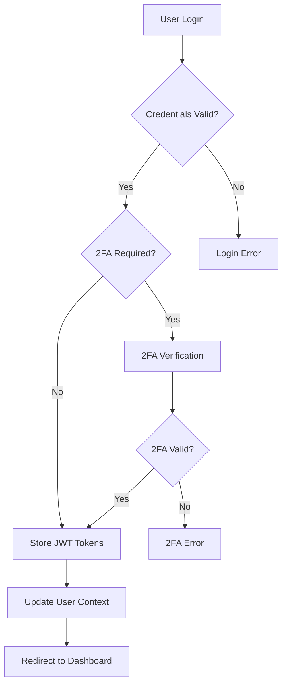

# 2. 🔐 Authentication System

## JWT Token Management

The authentication system uses a dual-token approach with automatic refresh:

```typescript
// Token Storage (src/utils/auth.utils.ts)
export const storeTokens = (accessToken: string, refreshToken: string) => {
    localStorage.setItem('access_token', accessToken);
    localStorage.setItem('refresh_token', refreshToken);
};

// Automatic Token Refresh (src/api/base.api.ts)
apiClient.interceptors.response.use(
    (response) => response,
    async (error) => {
        if (error.response?.status === 401) {
            const newToken = await AuthApi.refreshToken();
            // Retry original request with new token
            return apiClient(originalRequest);
        }
        return Promise.reject(error);
    }
);
```

## Authentication Flow



## Key Features
- **JWT Tokens**: Access token (short-lived) + Refresh token (long-lived)
- **2FA Support**: Time-based one-time passwords
- **Auto Refresh**: Transparent token renewal
- **Permission Checking**: Role-based access control
- **Language Preferences**: Stored in JWT payload

## Auth API Methods
```typescript
// Login with credentials
await AuthApi.login({ email, password });

// Verify 2FA code
await AuthApi.verifyTwoFactor({ user_id, code });

// Refresh tokens
await AuthApi.refreshToken();

// Update language preference
await AuthApi.updateLanguagePreference(languageId);

// Logout
await AuthApi.logout();
```

---

**[← Previous: Architecture Overview](01-architecture-overview.md)** | **[Next: CMS Structure & Page System →](03-cms-structure-page-system.md)**
