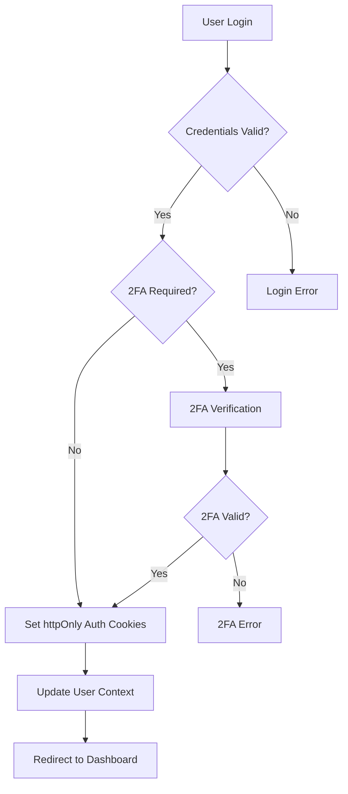

# 2. 🔐 Authentication System

## JWT Token Management

The browser never stores JWTs directly. Login/logout calls go through Next.js
auth routes, which set or clear httpOnly `sh_auth` / `sh_refresh` cookies. All
application API traffic goes through the `/api/*` BFF catch-all, where silent
refresh and request replay are handled server-side.

## Authentication Flow


```mermaid
graph TD
    A[User Login] --> B{Credentials Valid?}
    B -->|Yes| C{2FA Required?}
    B -->|No| D[Login Error]
    C -->|Yes| E[2FA Verification]
    C -->|No| F[Set httpOnly Auth Cookies]
    E --> G{2FA Valid?}
    G -->|Yes| F
    G -->|No| H[2FA Error]
    F --> I[Update User Context]
    I --> J[Redirect to Dashboard]
```

## Key Features
- **JWT Cookies**: Access token (short-lived) + Refresh token (long-lived), both httpOnly
- **2FA Support**: Time-based one-time passwords
- **Auto Refresh**: Transparent token renewal in the BFF proxy
- **Permission Checking**: Role-based access control
- **Language Preferences**: Stored in backend profile data and mirrored by cookies for SSR
- **Real-time ACL push**: `useAclEventStream` opens a Server-Sent Events
  channel to `/api/auth/events` so role / group / async-job permission
  changes refresh the navigation and admin sidebar **without a click**.

## Auth API Methods
```typescript
// Login with credentials
await AuthApi.login({ email, password });

// Verify 2FA code
await AuthApi.verifyTwoFactor({ user_id, code });

// Update language preference
await AuthApi.updateLanguagePreference(languageId);

// Logout
await AuthApi.logout();
```

## Helpers and where they live

| Concern                               | Helper                                                                                  |
|---------------------------------------|-----------------------------------------------------------------------------------------|
| Resolve the authenticated user (RSC)  | `getAuthMeSSR()` in `src/app/_lib/server-fetch.ts`                                       |
| Refine `authProvider`                 | `src/providers/auth.provider.ts` (cookie-driven; shares the `['user-data']` cache slot) |
| Read auth state (CC)                  | `useAuthUser()` / `useAuthStatus()` from `src/hooks/useUserData.ts`                     |
| Real-time ACL push                    | `useAclEventStream()` (`src/hooks/useAclEventStream.ts`) → `/api/auth/events` BFF route |
| ACL-version → cache invalidation      | `useAclVersionWatcher()` (`src/hooks/useAclVersionWatcher.ts`)                          |
| CSRF token (browser)                  | `readCsrfToken()` in `src/utils/auth.utils.ts`                                          |

For the full reference (every helper, every cookie, every BFF route) see
[`docs/reference/ssr-helpers.md`](../reference/ssr-helpers.md).

---

**[← Previous: Architecture Overview](01-architecture-overview.md)** | **[Next: CMS Structure & Page System →](03-cms-structure-page-system.md)**
