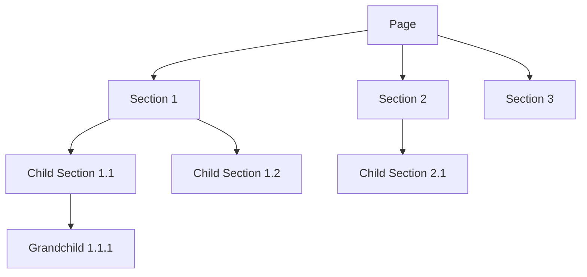

# 3. 🌐 CMS Structure & Page System

## Page-Section Hierarchy

The CMS follows a hierarchical structure where **Pages** contain **Sections**, and sections can contain **child sections**:


```mermaid
graph TD
    A[Page] --> B[Section 1]
    A --> C[Section 2]
    A --> D[Section 3]
    B --> E[Child Section 1.1]
    B --> F[Child Section 1.2]
    C --> G[Child Section 2.1]
    E --> H[Grandchild 1.1.1]
```

## Page Types & Properties

**Page Properties** (non-translatable):
- `keyword`: Unique identifier
- `url`: URL pattern
- `protocol`: HTTP methods allowed
- `headless`: Layout control
- `nav_position`: Header menu position
- `footer_position`: Footer menu position
- `page_access_type_code`: Access control
- `open_access`: Public access flag

**Page Content** (translatable):
- Dynamic fields based on page configuration
- Multi-language support
- Field types: text, textarea, markdown-inline, checkbox

## Section System

**Section Properties**:
- `id`: Unique identifier
- `name`: Display name
- `style_name`: Determines rendering component
- `position`: Order within parent
- `can_have_children`: Nesting capability
- `parent_id`: Parent section reference

**Dynamic Style Components**:
```typescript
// 82+ style components for different content types
const styleComponents = {
    'container': ContainerStyle,
    'heading': HeadingStyle,
    'markdown': MarkdownStyle,
    'image': ImageStyle,
    'button': ButtonStyle,
    'form': FormStyle,
    // ... 75+ more styles
};
```

## Page Rendering Process

1. **Route Resolution**: `[[...slug]]/page.tsx` catches all dynamic routes (Server Component)
2. **SSR Prefetch**: `getPageByKeywordSSRCached(keyword, languageId, preview)` (in `src/app/_lib/server-fetch.ts`) fetches the page payload server-side and dehydrates it into the React Query cache so the first paint already has content
3. **Content Fetching (client)**: `usePageContentByKeyword(keyword)` reads the dehydrated cache; on language change or admin preview toggle the query refetches via the BFF
4. **Section Rendering**: `BasicStyle` component routes to appropriate style component
5. **Field Extraction**: Helper functions extract content from dual structure

```typescript
// Field extraction pattern
const getFieldContent = (style: TStyle, fieldName: string): any => {
    // Direct property access
    if (style[fieldName]?.content !== undefined) {
        return style[fieldName].content;
    }
    // Nested fields object access
    if (style.fields?.[fieldName]?.content !== undefined) {
        return style.fields[fieldName].content;
    }
    return null;
};
```

---

**[← Previous: Authentication System](02-authentication-system.md)** | **[Next: React Query & Caching Strategy →](04-react-query-caching.md)**
