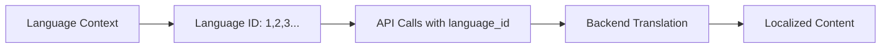

# 7. 🌍 Language System & Internationalization

## Language Architecture

The system supports multiple languages with ID-based backend communication:



## Language Context Structure

```typescript
// src/app/contexts/LanguageContext.tsx
interface ILanguageContextValue {
    currentLanguageId: number;        // Current language ID (1, 2, 3...)
    setCurrentLanguageId: (id: number) => void;
    languages: ILanguage[];           // Available languages
    setLanguages: (languages: ILanguage[]) => void;
    isUpdatingLanguage: boolean;      // Loading state
}
```

## Authentication-Aware Language System

**Non-Authenticated Users**:
- Language preference stored in localStorage
- Uses public `/languages` endpoint
- URL parameter persistence for language state

**Authenticated Users**:
- Language preference stored in JWT token
- API call to `/auth/set-language` updates preference
- Returns new JWT with updated language info

## Content Translation System

**Field Processing Rules**:

1. **Content Fields** (`display: 1`): Translatable fields
   - Process for ALL available languages
   - Examples: titles, descriptions, content

2. **Property Fields** (`display: 0`): System fields
   - Always save with language ID 1 only
   - Examples: CSS, configuration settings, URLs

```typescript
// Field processing utility
const processFieldsByType = (fields: IField[], languages: ILanguage[]) => {
    return fields.map(field => {
        if (field.display === 1) {
            // Content field - process for all languages
            return processForAllLanguages(field, languages);
        } else {
            // Property field - language ID 1 only
            return processForLanguageOne(field);
        }
    });
};
```

## Language API Integration

```typescript
// Page content with language support
GET /pages/home?language_id=2

// Admin pages with language support
GET /admin/pages/home?language_id=3

// Language preference update
POST /auth/set-language
{
    "language_id": 3
}

// Response includes updated JWT
{
    "data": {
        "access_token": "new_jwt_token",
        "language_id": 3,
        "language_locale": "de-CH"
    }
}
```

---

**[← Previous: API Layer & Endpoint Management](06-api-layer-endpoints.md)** | **[Next: Admin Panel & Inspector System →](08-admin-panel-inspector.md)**
