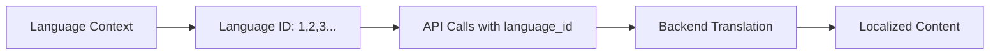

# 7. 🌍 Language System & Internationalization

## Language Architecture

The system supports multiple languages with ID-based backend communication:


```mermaid
graph LR
    A[Language Context] --> B[Language ID: 1,2,3...]
    B --> C[API Calls with language_id]
    C --> D[Backend Translation]
    D --> E[Localized Content]
```

## Language Context Structure

```typescript
// src/app/contexts/LanguageContext.tsx
interface ILanguageContextValue {
    currentLanguageId: number;        // Current language ID (1, 2, 3...)
    setCurrentLanguageId: (id: number) => void;
    languages: ILanguage[];           // Available languages
    setLanguages: (languages: ILanguage[]) => void;
    isUpdatingLanguage: boolean;      // Loading state
}
```

## Authentication-Aware Language System

**Non-Authenticated Users**:
- Language preference stored in `sh_lang` cookie for SSR
- Uses public `/languages` endpoint
- Server and client both resolve the same initial language

**Authenticated Users**:
- Language preference stored in the backend user profile
- API call to `/auth/set-language` updates preference
- BFF handles any token rotation through httpOnly cookies

## SSR resolution

Language is resolved server-side **once per request** by
`resolveLanguageSSR()` (in `src/app/_lib/server-fetch.ts`) using a strict
priority chain:

1. `sh_lang` cookie — the explicit user choice, stamped on every change
2. `sh_accept_locale` hint — set by `src/proxy.ts` from the
   browser's `Accept-Language` header on the very first visit
3. First language returned by the live `/languages` endpoint — the DB is
   the source of truth, so no hardcoded id can drift when an admin
   renames or deletes a language

The function returns `{ id, locale, htmlLang, languages }` — `htmlLang`
is dropped onto `<html lang="…">` in the root layout, the rest is
threaded through `ServerProviders` into `LanguageProvider`. The same
call is wrapped in React's `cache()` so calling it from the layout, the
page, and `generateMetadata` only hits Symfony once.

## Switching language (browser)

`LanguageContext.setCurrentLanguageId` stamps the `sh_lang` cookie via
the shared `writeBrowserCookie` helper (`src/utils/auth.utils.ts`) and
invalidates the language-scoped query keys. The next SSR pass picks
the cookie up automatically; the URL is **not** modified — there is no
`?language=…` parameter anymore.

## Content Translation System

**Field Processing Rules**:

1. **Content Fields** (`display: 1`): Translatable fields
   - Process for ALL available languages
   - Examples: titles, descriptions, content

2. **Property Fields** (`display: 0`): System fields
   - Always save with language ID 1 only
   - Examples: CSS, configuration settings, URLs

```typescript
// Field processing utility
const processFieldsByType = (fields: IField[], languages: ILanguage[]) => {
    return fields.map(field => {
        if (field.display === 1) {
            // Content field - process for all languages
            return processForAllLanguages(field, languages);
        } else {
            // Property field - language ID 1 only
            return processForLanguageOne(field);
        }
    });
};
```

## Language API Integration

```typescript
// Page content with language support
GET /pages/home?language_id=2

// Admin pages with language support
GET /admin/pages/home?language_id=3

// Language preference update
POST /auth/set-language
{
    "language_id": 3
}

// Response includes selected language; token rotation is handled by the BFF
{
    "data": {
        "language_id": 3,
        "language_locale": "de-CH"
    }
}
```

---

**[← Previous: API Layer & Endpoint Management](06-api-layer-endpoints.md)** | **[Next: Admin Panel & Inspector System →](08-admin-panel-inspector.md)**
