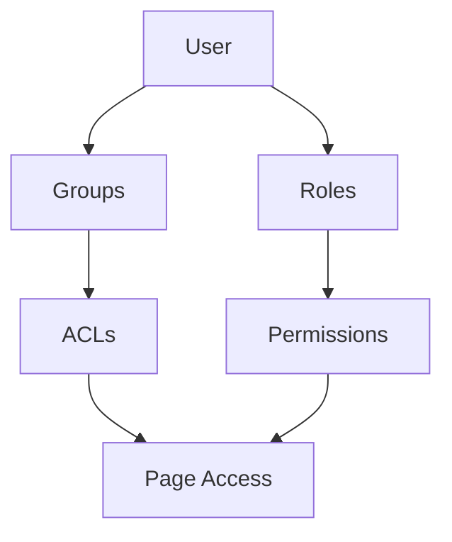
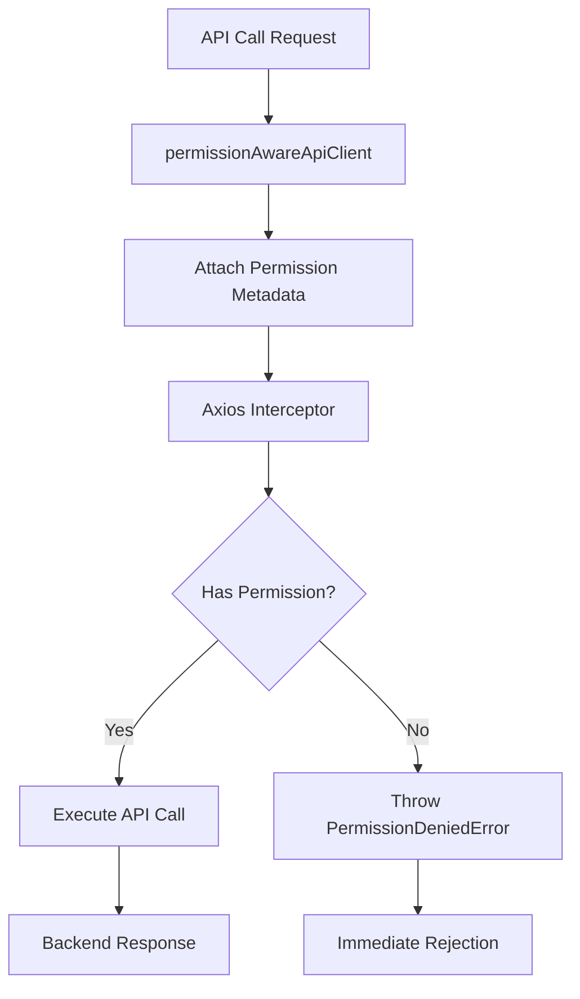

# 9. 👥 User Permissions & ACL System

## Permission Architecture

The system implements role-based access control (RBAC) with granular permissions:



## Permission Structure

**Users** can have:
- Direct **Roles** (with permissions)
- **Group** memberships (with ACLs)

**Groups** have:
- **ACLs** (Access Control Lists) for specific pages
- Page-level permissions: Select, Insert, Update, Delete

**Roles** have:
- System-wide **Permissions**
- Administrative capabilities

## ACL Management System

```typescript
// ACL structure for groups
interface IACL {
    page_id: number;
    acl_select: boolean;    // View permission
    acl_insert: boolean;    // Create permission
    acl_update: boolean;    // Edit permission
    acl_delete: boolean;    // Delete permission
}

// ACL management component
<AclManagement
    groupId={groupId}
    collapsible={true}
    showSelectedCount={true}
    onAclsChange={handleAclsChange}
/>
```

## Permission Validation

**Frontend Validation**:
```typescript
// Check if user has specific permission
const hasPermission = (permission: string): boolean => {
    const user = getCurrentUser();
    return user?.permissions?.includes(permission) || false;
};

// Restrict UI based on permissions
{hasPermission('admin.users.create') && (
    <Button onClick={handleCreateUser}>Create User</Button>
)}
```

## Permission-Aware API Client Wrapper

The system implements a zero-configuration permission wrapper that automatically checks user permissions **before** making API calls, preventing unnecessary backend requests when users lack required permissions.

### Wrapper Architecture



### Permission Checking Flow

1. **Permission Metadata Attachment**: All API calls must use `permissionAwareApiClient` instead of the raw `apiClient`
2. **Pre-Flight Permission Check**: Axios interceptor validates user permissions before the HTTP request
3. **Early Rejection**: If permissions are insufficient, the request is rejected immediately without backend call
4. **Backend Validation**: Authorized requests still undergo backend permission validation as final security layer

### Usage Examples

```typescript
import { permissionAwareApiClient } from '@/api/permission-aware-client.api';
import { API_CONFIG } from '@/config/api.config';

// ✅ Correct: Uses permission-aware client with automatic permission checking
await permissionAwareApiClient.get(API_CONFIG.ENDPOINTS.ADMIN_USERS_GET_ALL);

// ❌ Incorrect: Bypasses permission checking
// await apiClient.get('/api/admin/users'); // Would throw error

// Dynamic routes work seamlessly
await permissionAwareApiClient.put(
    API_CONFIG.ENDPOINTS.ADMIN_USERS_UPDATE,
    userData,
    userId  // Route parameter
);
```

### Permission Metadata Structure

Each API call automatically attaches permission metadata:

```typescript
interface IPermissionMetadata {
    permissions: string[];     // Required permissions for this endpoint
    endpointKey: string;       // Identifier for the endpoint config
}
```

### Error Handling

```typescript
try {
    await permissionAwareApiClient.delete(API_CONFIG.ENDPOINTS.ADMIN_USERS_DELETE, userId);
} catch (error) {
    if (error instanceof PermissionDeniedError) {
        // User lacks permission - show appropriate UI feedback
        showPermissionDeniedToast();
    } else {
        // Handle other API errors
        handleApiError(error);
    }
}
```

### Benefits

- **Performance**: Eliminates unnecessary network requests
- **UX**: Immediate feedback for permission-denied actions
- **Security**: Defense-in-depth with frontend and backend validation
- **Zero Configuration**: Works automatically with existing API calls
- **Type Safety**: Full TypeScript support with endpoint configurations

## Backend Integration

- All API calls include JWT token with user permissions
- Backend validates permissions for each request
- Consistent permission checking across frontend and backend

## User Management Features

**User Operations**:
- Create, update, delete users
- Block/unblock users
- Send activation emails
- Clean user data
- Impersonate users (admin)

**Group & Role Assignment**:
- Add/remove users from groups
- Assign/revoke roles
- Permission validation during assignment
- Visual feedback for restricted permissions

---

**[← Previous: Admin Panel & Inspector System](08-admin-panel-inspector.md)** | **[Next: Data Access Management →](17-data-access-management.md)**
