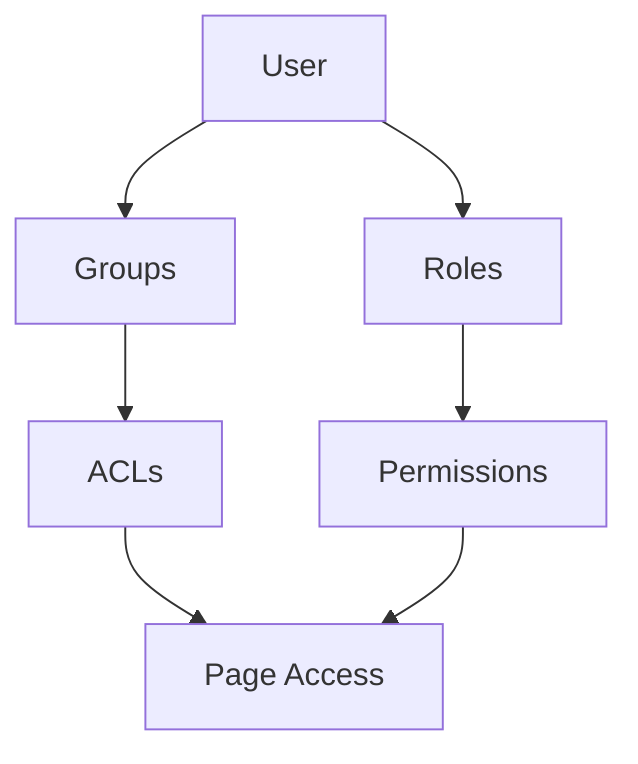

# 9. 👥 User Permissions & ACL System

## Permission Architecture

The system implements role-based access control (RBAC) with granular permissions:



## Permission Structure

**Users** can have:
- Direct **Roles** (with permissions)
- **Group** memberships (with ACLs)

**Groups** have:
- **ACLs** (Access Control Lists) for specific pages
- Page-level permissions: Select, Insert, Update, Delete

**Roles** have:
- System-wide **Permissions**
- Administrative capabilities

## ACL Management System

```typescript
// ACL structure for groups
interface IACL {
    page_id: number;
    acl_select: boolean;    // View permission
    acl_insert: boolean;    // Create permission
    acl_update: boolean;    // Edit permission
    acl_delete: boolean;    // Delete permission
}

// ACL management component
<AclManagement
    groupId={groupId}
    collapsible={true}
    showSelectedCount={true}
    onAclsChange={handleAclsChange}
/>
```

## Permission Validation

**Frontend Validation**:
```typescript
// Check if user has specific permission
const hasPermission = (permission: string): boolean => {
    const user = getCurrentUser();
    return user?.permissions?.includes(permission) || false;
};

// Restrict UI based on permissions
{hasPermission('admin.users.create') && (
    <Button onClick={handleCreateUser}>Create User</Button>
)}
```

**Backend Integration**:
- All API calls include JWT token with user permissions
- Backend validates permissions for each request
- Consistent permission checking across frontend and backend

## User Management Features

**User Operations**:
- Create, update, delete users
- Block/unblock users
- Send activation emails
- Clean user data
- Impersonate users (admin)

**Group & Role Assignment**:
- Add/remove users from groups
- Assign/revoke roles
- Permission validation during assignment
- Visual feedback for restricted permissions

---

**[← Previous: Admin Panel & Inspector System](08-admin-panel-inspector.md)** | **[Next: Responsive Design & Theming →](10-responsive-design-theming.md)**
