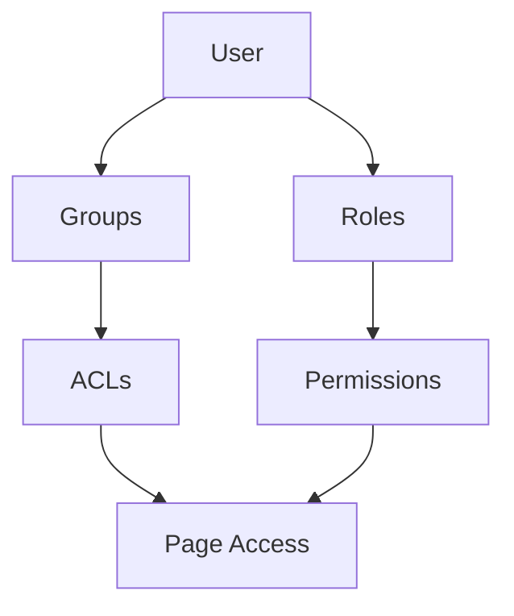
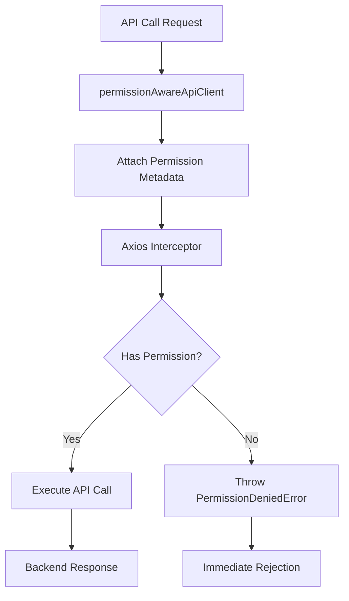

/*
SPDX-FileCopyrightText: 2026 Humdek, University of Bern
SPDX-License-Identifier: MPL-2.0
*/
# 9. 👥 User Permissions & ACL System

## Permission Architecture

The system implements role-based access control (RBAC) with granular permissions:


```mermaid
graph TD
    A[User] --> B[Groups]
    A --> C[Roles]
    B --> D[ACLs]
    C --> E[Permissions]
    D --> F[Page Access]
    E --> F
```

## Permission Structure

**Users** can have:
- Direct **Roles** (with permissions)
- **Group** memberships (with ACLs)

**Groups** have:
- **ACLs** (Access Control Lists) for specific pages
- Page-level permissions: Select, Insert, Update, Delete

**Roles** have:
- System-wide **Permissions**
- Administrative capabilities

## ACL Management System

```typescript
// ACL structure for groups
interface IACL {
    page_id: number;
    acl_select: boolean;    // View permission
    acl_insert: boolean;    // Create permission
    acl_update: boolean;    // Edit permission
    acl_delete: boolean;    // Delete permission
}

// ACL management component
<AclManagement
    groupId={groupId}
    collapsible={true}
    showSelectedCount={true}
    onAclsChange={handleAclsChange}
/>
```

## Permission Validation

**Frontend Validation**:
```typescript
// Check if user has specific permission
const hasPermission = (permission: string): boolean => {
    const user = getCurrentUser();
    return user?.permissions?.includes(permission) || false;
};

// Restrict UI based on permissions
{hasPermission('admin.users.create') && (
    <Button onClick={handleCreateUser}>Create User</Button>
)}
```

## Server-Side Admin Route Protection

The admin console (`/admin/*`) is gated **on the server, before any client
component mounts**. This is the authoritative authorization layer: an
unauthorized user is redirected away and the admin page — and therefore its
data-loading React Query hooks — never render. There is no "load the page, fire
the request, then handle a 403" flash.

### Why server-side

Previously the admin layout only verified *authentication* (a valid `sh_auth`
cookie + non-empty `/auth/user-data`). A logged-in user **without** the relevant
admin permission still rendered the page, so the page's data hook fired and
showed a spinner before the backend rejected the request. The fix moves the
*authorization* check into Server Components so the decision happens before the
client renders, on both the initial request and on client-side navigation
(App Router re-runs `page.tsx` server components on navigation).

### The guard module

`src/app/_lib/admin-guard.ts` exposes two helpers, both backed by the
`cache()`-wrapped `getAuthMeSSR()` (so they share a single `/auth/user-data`
round-trip per render):

```typescript
// Broad gate — used by src/app/admin/layout.tsx for the whole segment.
// Redirects to /login when unauthenticated, /no-access without `admin.access`.
await requireAdminAccessSSR();

// Per-page gate — admin.access PLUS a specific permission (or any of a list).
// Redirects to /no-access when the permission is missing.
await requireAdminPermission(PERMISSIONS.ADMIN_SCHEDULED_JOB_READ);
await requireAdminPermission([
    PERMISSIONS.ADMIN_PLUGINS_MANAGE,
    PERMISSIONS.ADMIN_PLUGINS_EXECUTE,
    PERMISSIONS.ADMIN_PLUGINS_PURGE,
]);
```

- **Unauthenticated** (no cookie / empty envelope) → redirect to `ROUTES.LOGIN`.
- **No `admin.access`** → redirect to `ROUTES.NO_ACCESS` (`/no-access`).
- **Missing the page's specific permission** → redirect to `ROUTES.NO_ACCESS`.

`/admin/layout.tsx` calls `requireAdminAccessSSR()` once for the segment; each
`page.tsx` (and `admin/pages/layout.tsx` for the client page editor) adds its
specific `requireAdminPermission(...)`. The permission strings mirror the
client `permissionChecker.canReadX()` checks used by `AdminNavbar`, so a hidden
sidebar link and a directly typed URL always resolve to the same decision.

### Route → required permission map

| Route | Required permission(s) |
|-------|------------------------|
| `/admin/*` (segment baseline) | `admin.access` (layout) |
| `/admin/users` | `admin.user.read` |
| `/admin/groups` | `admin.group.read` |
| `/admin/roles` | `admin.role.read` |
| `/admin/registration-codes` | `admin.registration_code.read` |
| `/admin/assets` | `admin.asset.read` |
| `/admin/unused-sections` | `admin.section.delete` |
| `/admin/pages/*` | `admin.page.read` (`pages/layout.tsx`) |
| `/admin/actions` | `admin.action.read` |
| `/admin/scheduled-jobs`, `/admin/scheduled-jobs/calendar` | `admin.scheduled_job.read` |
| `/admin/languages` | `admin.settings` |
| `/admin/data` | `admin.data.read` |
| `/admin/data-access` | `admin.audit.view` |
| `/admin/cache` | `admin.cache.read` |
| `/admin/plugins`, `/admin/plugins/[id]` | any of `admin.plugins.manage` / `.execute` / `.purge` |
| `/admin/plugins-host/*` | `admin.access` (plugin nav entry gates its own declared permission) |

### Adding a new admin page

1. Create the server `page.tsx` as usual (wrap content in `AdminShell`).
2. Make the default export `async` and call the guard **first**:

```typescript
import { requireAdminPermission } from '../../_lib/admin-guard';
import { PERMISSIONS } from '../../../types/auth/jwt-payload.types';

export default async function AdminWidgetsPage() {
    await requireAdminPermission(PERMISSIONS.ADMIN_WIDGET_READ);
    return (
        <AdminShell>
            {/* ... */}
        </AdminShell>
    );
}
```

3. Gate the matching sidebar link in `AdminNavbar` with the equivalent
   `permissionChecker.canReadX()` check so the nav and the route agree.

If a page is a Client Component (e.g. the page editor), gate it from the nearest
server `layout.tsx` in that route segment instead.

### Layers of defense

- **Server route guard (this section)** — authoritative; prevents render + fetch.
- **`AdminShell` client check** — handles *mid-session* auth expiry (a 401 on a
  background refetch) by bouncing to `/login`.
- **Permission-aware API client** (below) — blocks calls the user can't make.
- **Backend** — every `/cms-api` route re-validates permissions server-side.

## Permission-Aware API Client Wrapper

The system implements a zero-configuration permission wrapper that automatically checks user permissions **before** making API calls, preventing unnecessary backend requests when users lack required permissions.

### Wrapper Architecture


```mermaid
graph TD
    A[API Call Request] --> B[permissionAwareApiClient]
    B --> C[Attach Permission Metadata]
    C --> D[Axios Interceptor]
    D --> E{Has Permission?}
    E -->|Yes| F[Execute API Call]
    E -->|No| G[Throw PermissionDeniedError]
    F --> H[Backend Response]
    G --> I[Immediate Rejection]
```

### Permission Checking Flow

1. **Permission Metadata Attachment**: All API calls must use `permissionAwareApiClient` instead of the raw `apiClient`
2. **Pre-Flight Permission Check**: Axios interceptor validates user permissions before the HTTP request
3. **Early Rejection**: If permissions are insufficient, the request is rejected immediately without backend call
4. **Backend Validation**: Authorized requests still undergo backend permission validation as final security layer

### Usage Examples

```typescript
import { permissionAwareApiClient } from '@/api/permission-aware-client.api';
import { API_CONFIG } from '@/config/api.config';

// ✅ Correct: Uses permission-aware client with automatic permission checking
await permissionAwareApiClient.get(API_CONFIG.ENDPOINTS.ADMIN_USERS_GET_ALL);

// ❌ Incorrect: Bypasses permission checking
// await apiClient.get('/api/admin/users'); // Would throw error

// Dynamic routes work seamlessly
await permissionAwareApiClient.put(
    API_CONFIG.ENDPOINTS.ADMIN_USERS_UPDATE,
    userData,
    userId  // Route parameter
);
```

### Permission Metadata Structure

Each API call automatically attaches permission metadata:

```typescript
interface IPermissionMetadata {
    permissions: string[];     // Required permissions for this endpoint
    endpointKey: string;       // Identifier for the endpoint config
}
```

### Error Handling

```typescript
try {
    await permissionAwareApiClient.delete(API_CONFIG.ENDPOINTS.ADMIN_USERS_DELETE, userId);
} catch (error) {
    if (error instanceof PermissionDeniedError) {
        // User lacks permission - show appropriate UI feedback
        showPermissionDeniedToast();
    } else {
        // Handle other API errors
        handleApiError(error);
    }
}
```

### Benefits

- **Performance**: Eliminates unnecessary network requests
- **UX**: Immediate feedback for permission-denied actions
- **Security**: Defense-in-depth with frontend and backend validation
- **Zero Configuration**: Works automatically with existing API calls
- **Type Safety**: Full TypeScript support with endpoint configurations

## Backend Integration

- All API calls include JWT token with user permissions
- Backend validates permissions for each request
- Consistent permission checking across frontend and backend

## User Management Features

**User Operations**:
- Create, update, delete users
- Block/unblock users
- Send activation emails
- Clean user data
- Impersonate users (admin)

**Group & Role Assignment**:
- Add/remove users from groups
- Assign/revoke roles
- Permission validation during assignment
- Visual feedback for restricted permissions

---

**[← Previous: Admin Panel & Inspector System](08-admin-panel-inspector.md)** | **[Next: Data Access Management →](17-data-access-management.md)**
