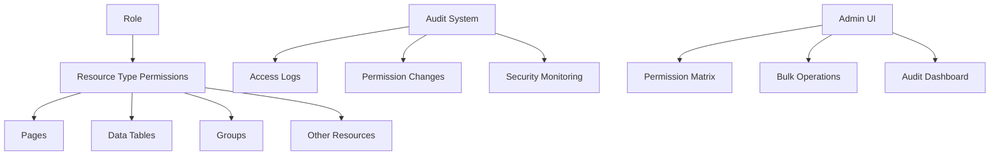
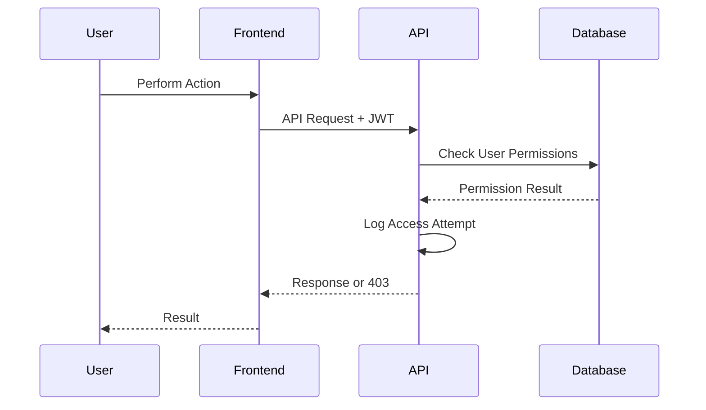

# 17. 🔐 Data Access Management System

## Overview

The Data Access Management system provides comprehensive role-based access control with granular permissions for different resource types. Unlike the legacy ACL system, this system operates at the resource level with CRUD permissions and includes comprehensive audit trails.

## Architecture



## Resource Types

The system supports multiple resource types with granular CRUD permissions:

| Resource Type | Lookup Code | Description |
|---------------|-------------|-------------|
| Pages | `pages` | CMS page access control |
| Data Tables | `data_table` | Custom data table permissions |
| Groups | `group` | User group management |
| Assets | `asset` | File and media resources |
| Sections | `section` | Page section components |

## Permission Bitwise System

Permissions use bitwise flags for efficient storage and checking:

```typescript
// Permission flags
CREATE = 1  // 001
READ   = 2  // 010
UPDATE = 4  // 100
DELETE = 8  // 1000

// Combined permissions
READ_ONLY        = 2  // 0010
READ_WRITE       = 6  // 0110 (READ + UPDATE)
FULL_ACCESS      = 15 // 1111 (CREATE + READ + UPDATE + DELETE)
NO_ACCESS        = 0  // 0000
```

## API Endpoints

### Role Management

```typescript
// Get all roles with permissions
GET /cms-api/v1/admin/data-access/roles

// Get effective permissions for a role
GET /cms-api/v1/admin/data-access/roles/{roleId}/effective-permissions

// Bulk set permissions for a role
POST /cms-api/v1/admin/data-access/roles/{roleId}/permissions
```

### Audit System

```typescript
// List audit logs with filtering
GET /cms-api/v1/admin/audit/data-access

// Get single audit log
GET /cms-api/v1/admin/audit/data-access/{id}

// Get audit statistics
GET /cms-api/v1/admin/audit/data-access/stats
```

## Permission Matrix Interface

The admin interface provides an intuitive matrix for managing permissions:

```typescript
interface IPermissionMatrixProps {
  roleId: number;
  resourceType: 'pages' | 'data_tables' | 'groups';
  onPermissionsChange: (permissions: IPermissionUpdate[]) => void;
}

interface IPermissionUpdate {
  resource_id: number;
  crud_permissions: number; // Bitwise permission value
}
```

### Features

- **Real-time Updates**: Changes reflect immediately in the UI
- **Bulk Operations**: Set multiple permissions in single API call
- **Change Detection**: Visual indicators for unsaved changes
- **Validation**: Prevents invalid permission combinations
- **Prefilling**: Automatically loads existing permissions

## Audit Trail System

### Access Logging

Every permission check is logged with comprehensive metadata:

```typescript
interface IAuditLog {
  id: number;
  idUsers: number;
  idResourceTypes: number;
  resourceId: number;
  idActions: number; // create, read, update, delete, list, filter, export, import
  idPermissionResults: number; // granted, denied
  crudPermission: number;
  httpMethod: string;
  requestBodyHash: string;
  ipAddress: string;
  userAgent: string;
  requestUri: string;
  createdAt: string;
}
```

### Audit Statistics

```typescript
interface IAuditStats {
  totalLogs: number;
  deniedAttempts: number;
  uniqueResources: number;
  uniqueUsers: number;
  mostAccessedResources: Array<{
    resourceType: string;
    resourceId: number;
    accessCount: number;
  }>;
  recentDeniedAttempts: IAuditLog[];
}
```

## Permission Validation Flow



## Implementation Details

### Permission Utilities

```typescript
// Parse bitwise permissions to boolean object
export const parseCrudPermissions = (value: number): ICrudPermissions => ({
  create: Boolean(value & 1),
  view: Boolean(value & 2),
  update: Boolean(value & 4),
  delete: Boolean(value & 8),
});

// Convert boolean object to bitwise value
export const stringifyCrudPermissions = (permissions: ICrudPermissions): number => {
  return (permissions.create ? 1 : 0) |
         (permissions.view ? 2 : 0) |
         (permissions.update ? 4 : 0) |
         (permissions.delete ? 8 : 0);
};
```

### React Query Integration

```typescript
// Fetch effective permissions
const { data: permissions } = useQuery({
  queryKey: ['role-permissions', roleId],
  queryFn: () => AdminDataAccessApi.getRoleEffectivePermissions(roleId),
  staleTime: 5 * 60 * 1000, // 5 minutes
});

// Bulk update permissions
const mutation = useMutation({
  mutationFn: ({ roleId, permissions }: ISetPermissionsParams) =>
    AdminDataAccessApi.setRolePermissions(roleId, permissions),
  onSuccess: () => {
    queryClient.invalidateQueries({ queryKey: ['role-permissions'] });
  }
});
```

## Security Considerations

### Audit Requirements

- **Complete Logging**: All permission checks are logged
- **Immutable Logs**: Audit entries cannot be modified
- **PII Protection**: Sensitive data is masked in logs
- **Retention Policy**: Configurable log retention periods

### Performance Optimization

- **Efficient Queries**: Bitwise operations for fast permission checks
- **Caching Strategy**: React Query caching with appropriate stale times
- **Bulk Operations**: Reduce API calls with batch permission updates
- **Lazy Loading**: Load permissions only when needed

## Migration from Legacy ACL

The new system replaces the older group-based ACL system:

| Legacy ACL | Data Access Management |
|------------|----------------------|
| Page-level only | Resource-type agnostic |
| Simple CRUD flags | Bitwise permission values |
| Group-centric | Role-centric |
| Limited audit | Comprehensive audit trail |
| Manual permission checks | Automated validation |

## Best Practices

### Permission Design

1. **Principle of Least Privilege**: Grant minimum required permissions
2. **Role Hierarchy**: Use role inheritance where appropriate
3. **Regular Audits**: Review permission assignments periodically
4. **Clear Naming**: Use descriptive resource and role names

### Performance

1. **Batch Updates**: Use bulk operations for multiple changes
2. **Caching**: Leverage React Query for permission caching
3. **Lazy Loading**: Load permissions on-demand
4. **Efficient Queries**: Use indexed database queries

### Security

1. **Input Validation**: Validate all permission inputs
2. **Audit Monitoring**: Regularly review audit logs for anomalies
3. **Access Reviews**: Periodic permission review processes
4. **Fail-Safe Defaults**: Deny access by default

---

**[← Previous: User Permissions & ACL System](09-user-permissions-acl.md)** | **[Next: Expansion Guide →](13-expansion-guide.md)**</content>
</xai:function_call">Writing to docs/guides/17-data-access-management.md
